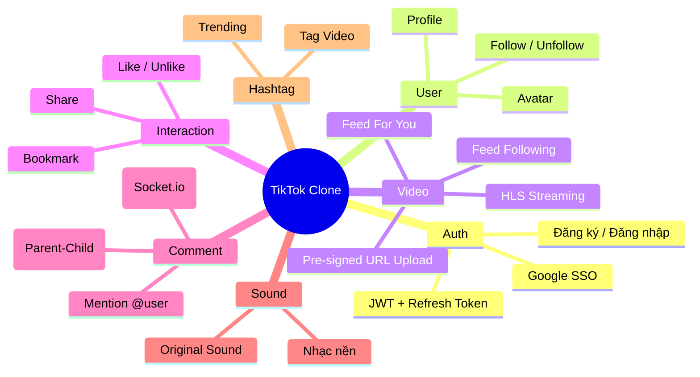
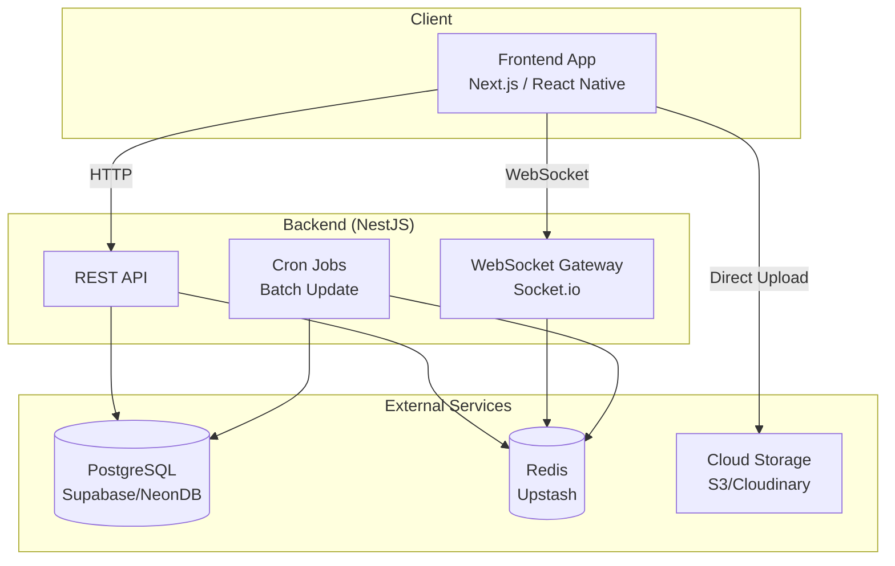

# 🎯 Tổng Quan Dự Án — TikTok Clone Backend

> **Nguồn gốc:** Tổng hợp từ [overview-project.md](./overview-project.md) và [detail-project.md](./detail-project.md)

---

## 1. Giới thiệu

Dự án xây dựng **Backend API** cho một ứng dụng chia sẻ video ngắn theo mô hình TikTok, sử dụng **NestJS (TypeScript)** kết hợp hệ sinh thái Cloud hiện đại. Mục tiêu là tạo ra một hệ thống **production-ready**, có khả năng scale và dễ dàng migrate giữa các nền tảng hosting.

---

## 2. Vision & Mục tiêu

### 2.1 Mục tiêu kỹ thuật
- Xây dựng Backend **Stateless** theo chuẩn **12-Factor App**
- Sử dụng kiến trúc **Modular** của NestJS cho khả năng mở rộng
- Hỗ trợ **Realtime** cho tính năng Comment qua WebSocket (Socket.io)
- Tối ưu hiệu năng bằng **Redis Cache** và **Batch Processing**
- Sử dụng **HLS Streaming** cho video thay vì phát trực tiếp file MP4

### 2.2 Mục tiêu sản phẩm
- Người dùng có thể đăng ký/đăng nhập (Local + Google SSO)
- Upload và xem video ngắn với trải nghiệm mượt mà
- Tương tác: Like, Comment (realtime), Share, Bookmark
- Hệ thống Follow/Unfollow và Feed cá nhân hóa
- Tìm kiếm qua Hashtag

---

## 3. Nguyên tắc thiết kế cốt lõi

> Chi tiết đầy đủ tại [detail-project.md](./detail-project.md)

### 🔑 4 Nguyên tắc "Chạy Đâu Cũng Được"

| # | Nguyên tắc | Mô tả |
|---|-----------|-------|
| 1 | **Stateless** | App không lưu file vật lý lên server. 100% media (video, avatar) lưu trên S3/Cloudinary |
| 2 | **100% Environment Variables** | Mọi cấu hình đọc qua `.env`. Code không biết nó đang chạy ở đâu |
| 3 | **Database as a Service** | Dùng Supabase/NeonDB độc lập, tách biệt khỏi hosting |
| 4 | **Docker** | Đóng gói toàn bộ app vào Docker Image để di chuyển dễ dàng |

---

## 4. Tính năng cốt lõi (Core Features)

---

## 5. Scope & Giới hạn

### ✅ Trong scope (MVP)
- Authentication (JWT + Google SSO)
- CRUD Video với Pre-signed URL upload
- Feed với Cursor-based Pagination
- Like, Comment (realtime), Bookmark
- Follow/Unfollow
- Hashtag system
- HLS Video Streaming

### ❌ Ngoài scope (Giai đoạn sau)
- Duet / Stitch video
- Live Streaming
- Direct Message (DM)
- AI-based Recommendation Engine nâng cao
- Content Moderation tự động
- Push Notification (Mobile)

---

## 6. Tổng quan kiến trúc

> Chi tiết kiến trúc tại [05-kien-truc-he-thong.md](./05-kien-truc-he-thong.md)

---

## 7. Liên kết nhanh

| Tài liệu | Mô tả |
|-----------|-------|
| [Tech Stack](./02-tech-stack.md) | Công nghệ sử dụng |
| [Lộ trình](./03-lo-trinh-phases.md) | Kế hoạch triển khai |
| [ERD & Schema](./04-erd-va-schema.md) | Thiết kế Database |
| [Docker & Deploy](./06-docker-va-deployment.md) | Triển khai & DevOps |
| [Env Variables](./07-environment-variables.md) | Biến môi trường |
