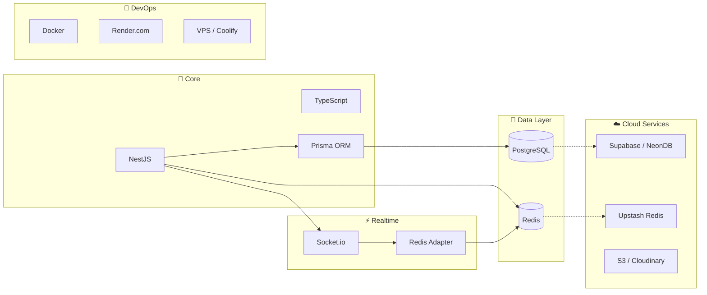
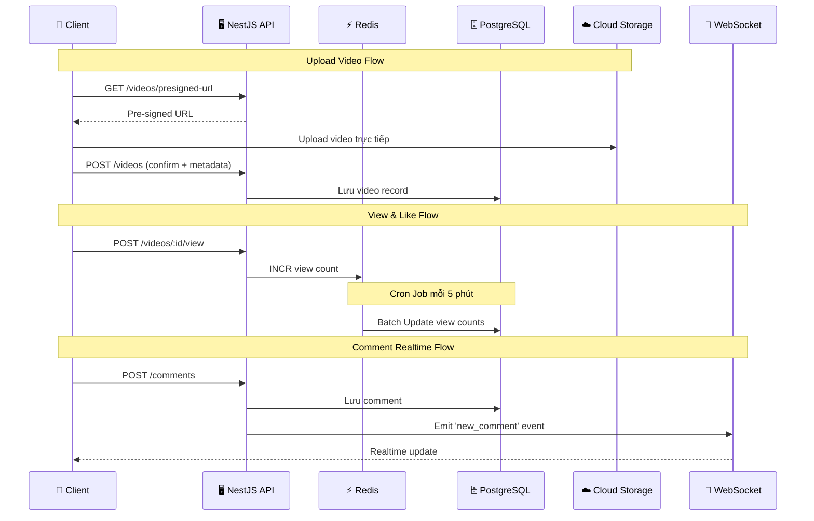

# 🛠️ Tech Stack — TikTok Clone Backend

> **Nguồn gốc:** Tổng hợp từ [overview-project.md](./overview-project.md) mục 1 & [detail-project.md](./detail-project.md)

---

## 1. Tổng quan Tech Stack



---

## 2. Chi tiết từng công nghệ

### 2.1 Backend Framework

| Công nghệ | Version | Vai trò | Lý do chọn |
|-----------|---------|---------|------------|
| **NestJS** | Latest | Backend Framework | Kiến trúc modular, dependency injection, TypeScript native, dễ scale |
| **TypeScript** | 5.x | Ngôn ngữ chính | Type-safe, IntelliSense tốt, giảm bug runtime |
| **Passport.js** | Latest | Authentication | Hỗ trợ nhiều strategy (JWT, OAuth2), mature ecosystem |

### 2.2 Database & ORM

| Công nghệ | Vai trò | Lý do chọn |
|-----------|---------|------------|
| **PostgreSQL** | RDBMS chính | Mạnh mẽ, hỗ trợ JSON, Full-text search, quan hệ phức tạp |
| **Prisma** | ORM | Type-safe query, migration tự động, schema declarative |
| **Supabase / NeonDB** | Hosting DB | Free tier tốt, Connection Pooling tích hợp, dễ migrate |

> [!IMPORTANT]
> **Connection Pooling là bắt buộc** khi chạy trên môi trường Serverless hoặc nhiều instance.
> Supabase và NeonDB đã tích hợp sẵn PgBouncer.

### 2.3 Caching & Queue

| Công nghệ | Vai trò | Lý do chọn |
|-----------|---------|------------|
| **Redis** | Cache + Queue | In-memory, cực nhanh, hỗ trợ Pub/Sub |
| **Upstash** | Hosting Redis | Serverless-friendly, HTTP-based API, Free tier |

**Redis được dùng cho:**
- 🔢 **Đếm View** — Accumulate trong Redis, batch write vào DB mỗi 5 phút
- ❤️ **Cache Like** — Tránh query DB mỗi lần kiểm tra đã like chưa
- 🚫 **Rate Limiting** — Chặn spam comment (5 lần/phút/user)
- 📡 **Socket.io Adapter** — Đồng bộ WebSocket giữa nhiều server instances
- 📋 **Cache Feed** — Cache danh sách video đã tính toán

### 2.4 File Storage

| Công nghệ | Vai trò | Lý do chọn |
|-----------|---------|------------|
| **Cloudinary** | Video/Image Storage | Tự động nén, tối ưu, convert sang HLS, CDN tích hợp |
| **AWS S3** | Alternative Storage | Giá rẻ, dung lượng lớn, Pre-signed URL |
| **Cloudflare R2** | Alternative Storage | Không tính phí egress, tương thích S3 API |

> [!TIP]
> **Cloudinary được ưu tiên** cho video vì hỗ trợ:
> - Tự động convert MP4 → HLS (M3U8)
> - Adaptive Bitrate Streaming
> - CDN toàn cầu
> - Thumbnail generation tự động

### 2.5 Realtime

| Công nghệ | Vai trò | Lý do chọn |
|-----------|---------|------------|
| **Socket.io** | WebSocket | Bi-directional, auto-reconnect, room support |
| **@nestjs/websockets** | NestJS Integration | Tích hợp native với NestJS ecosystem |
| **Redis Adapter** | Scale WebSocket | Cho phép nhiều server instances chia sẻ event |

> [!NOTE]
> Khi self-host trên VPS, sử dụng Socket.io trực tiếp (miễn phí, không giới hạn).
> Trên Render.com, Socket.io cũng hoạt động bình thường (không như Vercel).

### 2.6 DevOps & Deployment

| Công nghệ | Vai trò | Lý do chọn |
|-----------|---------|------------|
| **Docker** | Containerization | "Build once, run anywhere", đảm bảo consistency |
| **Render.com** | Hosting ban đầu | Free tier, hỗ trợ Docker, WebSocket, dễ setup |
| **Coolify** | Self-hosted PaaS | Alternative cho Heroku/Render trên VPS, UI đẹp |
| **GitHub** | Source Control | CI/CD integration, Render/Coolify auto-deploy |

---

## 3. Sơ đồ Data Flow



---

## 4. Dependencies chính (package.json)

```json
{
  "dependencies": {
    "@nestjs/common": "^10.x",
    "@nestjs/core": "^10.x",
    "@nestjs/config": "^3.x",
    "@nestjs/passport": "^10.x",
    "@nestjs/jwt": "^10.x",
    "@nestjs/platform-socket.io": "^10.x",
    "@nestjs/websockets": "^10.x",
    "@nestjs/schedule": "^4.x",
    "@prisma/client": "^5.x",
    "passport": "^0.7.x",
    "passport-jwt": "^4.x",
    "passport-google-oauth20": "^2.x",
    "ioredis": "^5.x",
    "@socket.io/redis-adapter": "^8.x",
    "@aws-sdk/client-s3": "^3.x",
    "@aws-sdk/s3-request-presigner": "^3.x",
    "class-validator": "^0.14.x",
    "class-transformer": "^0.5.x",
    "winston": "^3.x"
  },
  "devDependencies": {
    "prisma": "^5.x",
    "@nestjs/cli": "^10.x",
    "@nestjs/testing": "^10.x"
  }
}
```

---

## 5. Liên kết

| Tài liệu | Link |
|-----------|------|
| Kiến trúc hệ thống | [05-kien-truc-he-thong.md](./05-kien-truc-he-thong.md) |
| Docker & Deploy | [06-docker-va-deployment.md](./06-docker-va-deployment.md) |
| Environment Variables | [07-environment-variables.md](./07-environment-variables.md) |
