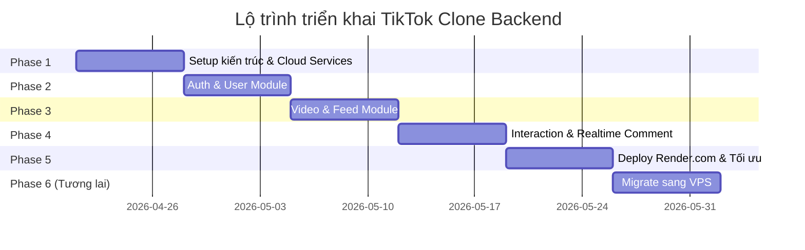

# 📅 Lộ Trình Triển Khai — TikTok Clone Backend

> **Nguồn gốc:** Tổng hợp từ [overview-project.md](./overview-project.md) mục 3 & phần "Lộ trình triển khai"

---

## Tổng quan Phases



---

## Phase 1: Setup Kiến Trúc & Dịch Vụ Cloud (Tuần 1)

> **Nguyên tắc cốt lõi:** Stateless — App không lưu trạng thái/file vật lý

### 📋 Checklist

- [ ] **Khởi tạo External Services**
  - [ ] Tạo tài khoản **Supabase** (hoặc NeonDB) → lấy `DATABASE_URL`
  - [ ] Tạo tài khoản **Upstash** → lấy `REDIS_URL`
  - [ ] Tạo tài khoản **Cloudinary** hoặc **AWS S3** → lấy credentials

- [ ] **Khởi tạo Codebase**
  - [ ] `nest new tiktok-clone`
  - [ ] Cài Prisma: `npm install prisma --save-dev` → `npx prisma init`
  - [ ] Viết `Dockerfile` chuẩn multi-stage → xem [Docker & Deploy](./06-docker-va-deployment.md)
  - [ ] Setup `.gitignore`, `.env.example`

- [ ] **Cấu hình cơ bản**
  - [ ] Setup `@nestjs/config` — bắt buộc mọi config đọc qua `.env`
  - [ ] Viết **Global Exception Filter** — format lỗi chuẩn
  - [ ] Setup **Logger** (Winston hoặc Pino)
  - [ ] Cấu hình JWT Authentication & Guard
  - [ ] Setup Prisma Service (singleton)

### 🎯 Output
```
✅ NestJS project chạy được
✅ Kết nối thành công PostgreSQL + Redis
✅ Dockerfile hoạt động
✅ JWT Guard sẵn sàng
```

---

## Phase 2: Auth & User Module (Tuần 2)

### 📋 Checklist

- [ ] **Auth Module** → Chi tiết tại [auth-module.md](./modules/auth-module.md)
  - [ ] API Đăng ký (`POST /auth/register`)
  - [ ] API Đăng nhập (`POST /auth/login`) → trả JWT
  - [ ] API Refresh Token (`POST /auth/refresh`)
  - [ ] API Google SSO (`POST /auth/google`)
  - [ ] Hash password bằng `bcrypt`
  - [ ] Implement Access Token (15m) + Refresh Token (7d)

- [ ] **User Module** → Chi tiết tại [user-module.md](./modules/user-module.md)
  - [ ] API Lấy Profile (`GET /users/:id`)
  - [ ] API Cập nhật Profile (`PATCH /users/me`)
  - [ ] API Upload Avatar (lưu URL string từ Cloudinary)
  - [ ] API Follow (`POST /users/:id/follow`)
  - [ ] API Unfollow (`DELETE /users/:id/follow`)

> [!IMPORTANT]
> **Kinh nghiệm thực tế — Đếm Follower:**
> Không dùng `SELECT COUNT(*)` mỗi lần vào profile.
> Phải dùng **Prisma Transaction** để vừa thêm record Follow, vừa `increment` field `followerCount` / `followingCount`.

### 🎯 Output
```
✅ Đăng ký/Đăng nhập/Refresh Token hoạt động
✅ Google SSO flow hoàn chỉnh
✅ CRUD Profile + Avatar
✅ Follow/Unfollow với counter đồng bộ
```

---

## Phase 3: Video Upload & Feed (Tuần 3)

### 📋 Checklist

- [ ] **Video Module** → Chi tiết tại [video-module.md](./modules/video-module.md)
  - [ ] API Generate Pre-signed URL (`GET /videos/presigned-url`)
  - [ ] API Confirm Upload (`POST /videos`)
  - [ ] API Get Feed - For You (`GET /videos/feed`)
  - [ ] API Get Feed - Following (`GET /videos/following`)
  - [ ] API Get User Videos (`GET /users/:id/videos`)
  - [ ] Cursor-based Pagination

- [ ] **View Counter (Redis + CronJob)**
  - [ ] API Record View (`POST /videos/:id/view`)
  - [ ] Đẩy view vào Redis (`INCR`)
  - [ ] CronJob mỗi 5 phút: gom view từ Redis → batch update DB

- [ ] **Sound & Hashtag Module** → Chi tiết tại [sound-module.md](./modules/sound-module.md), [hashtag-module.md](./modules/hashtag-module.md)
  - [ ] Gắn Sound (nhạc nền) với Video
  - [ ] Parse hashtag từ caption → tạo record Hashtag + VideoHashtag

> [!WARNING]
> **Tránh nút thắt cổ chai Upload Video:**
> - ❌ KHÔNG upload file qua Backend (sẽ bị timeout)
> - ✅ Backend cấp Pre-signed URL → Client upload trực tiếp lên S3/Cloudinary → Gọi API confirm

> [!TIP]
> **Cursor-based Pagination** thay vì Offset/Limit:
> Feed thêm video liên tục, dùng Offset sẽ bị lặp video. Dùng `cursor` (ID video cuối) làm mốc.

### 🎯 Output
```
✅ Upload video qua Pre-signed URL
✅ Feed For You + Following hoạt động
✅ View count tối ưu qua Redis
✅ Hashtag gắn tự động
```

---

## Phase 4: Tương Tác & Realtime Comment (Tuần 4)

### 📋 Checklist

- [ ] **Interaction Module** → Chi tiết tại [interaction-module.md](./modules/interaction-module.md)
  - [ ] API Like/Unlike (`POST /videos/:id/like`, `DELETE /videos/:id/like`)
  - [ ] API Bookmark (`POST /videos/:id/bookmark`, `DELETE /videos/:id/bookmark`)
  - [ ] Cache Like trên Redis (tương tự View)

- [ ] **Comment Module (Realtime)** → Chi tiết tại [comment-module.md](./modules/comment-module.md)
  - [ ] API Tạo Comment (`POST /videos/:id/comments`)
  - [ ] API Lấy Comments (`GET /videos/:id/comments`)
  - [ ] Nested Comments (Parent-Child)
  - [ ] Mention @user
  - [ ] Setup Socket.io Gateway
  - [ ] Lưu DB → `server.to(videoId).emit('new_comment', data)`
  - [ ] Redis Adapter cho Socket.io

- [ ] **Rate Limiting**
  - [ ] Redis-based rate limit: 1 user chỉ comment 5 lần/phút

> [!TIP]
> **Optimistic UI cho Like:**
> Frontend hiển thị animation ngay lập tức, debounce 1-2s rồi mới gọi API.
> Tránh user spam like làm sập DB.

### 🎯 Output
```
✅ Like/Unlike/Bookmark hoạt động
✅ Comment realtime qua WebSocket
✅ Nested comments (reply)
✅ Rate limiting chặn spam
```

---

## Phase 5: Deploy & Tối Ưu (Tuần 5)

> Chi tiết deploy tại [06-docker-va-deployment.md](./06-docker-va-deployment.md)

### 📋 Checklist

- [ ] **Deploy lên Render.com**
  - [ ] Push code lên GitHub
  - [ ] Tạo Web Service trên Render, chọn Environment: Docker
  - [ ] Nhập tất cả biến `.env` vào Render Dashboard
  - [ ] Deploy → nhận URL (vd: `tiktok-api.onrender.com`)
  - [ ] Trỏ Custom Domain qua CNAME

- [ ] **Tối ưu Database**
  - [ ] Index các cột: `authorId`, `videoId`, `createdAt`
  - [ ] Review N+1 query
  - [ ] Tối ưu Prisma select (chỉ lấy field cần thiết)

- [ ] **Test tải**
  - [ ] Load Testing bằng K6 hoặc Artillery
  - [ ] Benchmark API response time
  - [ ] Stress test WebSocket connections

### 🎯 Output
```
✅ App chạy trên production URL
✅ Custom domain hoạt động
✅ Database indexes tối ưu
✅ Load test pass
```

---

## Phase 6: Migrate sang VPS — Zero Downtime (Tương lai)

> Chi tiết tại [06-docker-va-deployment.md](./06-docker-va-deployment.md#migrate-sang-vps)

### 📋 Checklist

- [ ] **Chuẩn bị VPS**
  - [ ] Mua VPS (Hetzner ~ 100k/tháng)
  - [ ] Cài Docker hoặc Coolify

- [ ] **Deploy Code lên VPS (Render vẫn chạy)**
  - [ ] Kết nối Coolify với GitHub repo
  - [ ] Copy biến `.env` từ Render sang Coolify
  - [ ] Deploy trên VPS → test thử API

- [ ] **Switch DNS (Zero Downtime)**
  - [ ] Sửa DNS: Xóa CNAME (Render) → Thêm A Record (IP VPS)  
  - [ ] Bật SSL/HTTPS trên Coolify
  - [ ] Đợi DNS propagation (1-5 phút)

- [ ] **Hoàn tất**
  - [ ] Verify traffic đã sang VPS
  - [ ] Suspend/Delete Web Service trên Render

> [!NOTE]
> Vì Database (Supabase) và Storage (S3) đều nằm ngoài, nên VPS kết nối vào cùng data.
> User không hề hay biết hệ thống đã "chuyển nhà".

---

## Tóm tắt Timeline

| Phase | Thời gian | Trọng tâm | Modules |
|-------|-----------|-----------|---------|
| **1** | Tuần 1 | Setup & Config | Core, Prisma, Docker |
| **2** | Tuần 2 | Auth & Social | Auth, User, Follow |
| **3** | Tuần 3 | Video & Content | Video, Feed, Sound, Hashtag |
| **4** | Tuần 4 | Interaction & RT | Like, Comment, WebSocket |
| **5** | Tuần 5 | Deploy & Optimize | Render, Index, Test |
| **6** | Tương lai | Migration | VPS, Coolify, DNS |
