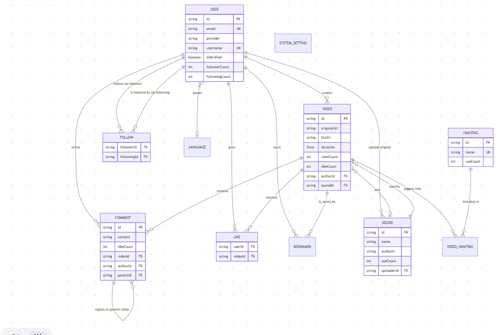
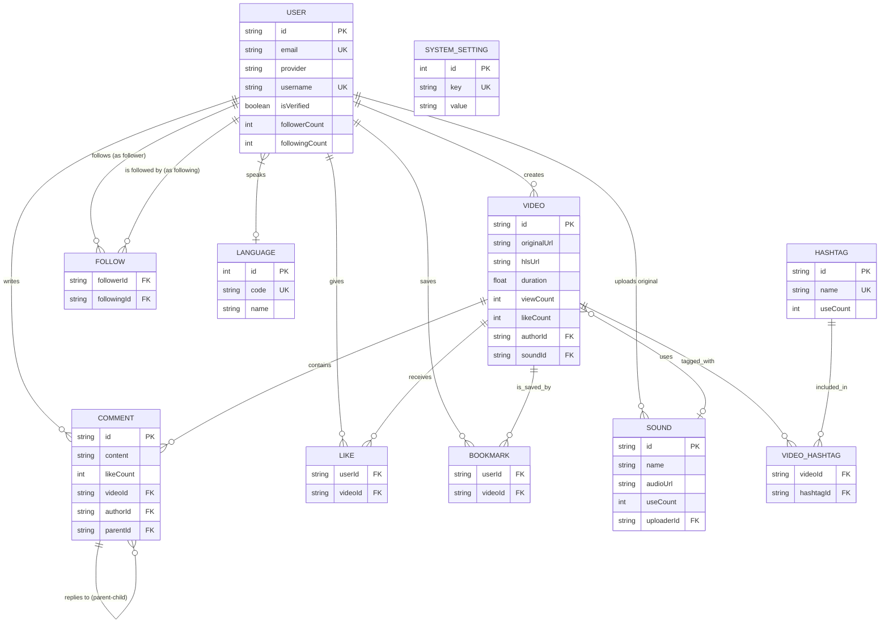

# 🗄️ ERD & Database Schema — TikTok Clone

> **Nguồn gốc:**
> - Schema: [schema-sample.md](./schema-sample.md)
> - ERD: [ERD-diagram.md](./ERD-diagram.md)
> - Ảnh ERD: [ERD1.png](./ERD1.png)

---

## 1. Entity Relationship Diagram (ERD)

### 1.1 ERD trực quan



### 1.2 ERD — Mermaid



---

## 2. Tổng quan các Table

| Table | Loại | Mô tả | PK |
|-------|------|--------|-----|
| `User` | Core | Người dùng, thông tin profile, auth | `id` (UUID) |
| `Video` | Core | Video ngắn, metadata, metrics | `id` (UUID) |
| `Comment` | Core | Bình luận (hỗ trợ nested) | `id` (UUID) |
| `Sound` | Core | Nhạc nền gắn với video | `id` (UUID) |
| `Follow` | Junction | Quan hệ follow giữa 2 User | `[followerId, followingId]` |
| `Like` | Junction | User like Video | `[userId, videoId]` |
| `Bookmark` | Junction | User lưu Video | `[userId, videoId]` |
| `Hashtag` | Reference | Tag phân loại | `id` (UUID) |
| `VideoHashtag` | Junction | Gắn Hashtag vào Video | `[videoId, hashtagId]` |
| `Language` | Master | Ngôn ngữ hỗ trợ | `id` (Auto Increment) |
| `SystemSetting` | System | Cấu hình hệ thống | `id` (Auto Increment) |

---

## 3. Chi tiết Schema (Prisma)

> **File gốc đầy đủ:** [schema-sample.md](./schema-sample.md)

### 3.1 Master Data & System

```prisma
model Language {
  id       Int      @id @default(autoincrement())
  code     String   @unique @db.VarChar(10) // vi, en, jp
  name     String   @db.VarChar(50)
  isActive Boolean  @default(true)
  users    User[]
}

model SystemSetting {
  id          Int      @id @default(autoincrement())
  key         String   @unique @db.VarChar(100)
  value       String   @db.Text
  description String?  @db.VarChar(255)
  updatedAt   DateTime @updatedAt
}
```

### 3.2 User & Authentication

```prisma
enum AuthProvider {
  LOCAL
  GOOGLE
  FACEBOOK
  APPLE
}

enum AccountStatus {
  ACTIVE
  BANNED
  SUSPENDED
}

model User {
  id             String        @id @default(uuid())
  email          String?       @unique
  phone          String?       @unique
  password       String?       // Null nếu là SSO
  provider       AuthProvider  @default(LOCAL)
  providerId     String?       // ID từ Google/Facebook

  username       String        @unique @db.VarChar(50)
  displayName    String        @db.VarChar(100)
  avatarUrl      String?       @db.Text
  bio            String?       @db.VarChar(200)
  dob            DateTime?     @db.Date
  gender         Int?          // 0: Khác, 1: Nam, 2: Nữ
  isVerified     Boolean       @default(false)
  status         AccountStatus @default(ACTIVE)

  languageId     Int?
  language       Language?     @relation(fields: [languageId], references: [id])

  // Denormalization (Counters)
  followerCount  Int           @default(0)
  followingCount Int           @default(0)
  totalLikes     Int           @default(0)

  createdAt      DateTime      @default(now())
  updatedAt      DateTime      @updatedAt

  // Relations
  videos     Video[]
  comments   Comment[]
  likes      Like[]
  bookmarks  Bookmark[]
  followers  Follow[]  @relation("UserFollowers")
  following  Follow[]  @relation("UserFollowing")
  sounds     Sound[]   @relation("UserUploadedSounds")
}
```

### 3.3 Follow (Junction)

```prisma
model Follow {
  followerId  String
  followingId String
  createdAt   DateTime @default(now())

  follower  User @relation("UserFollowing", fields: [followerId], references: [id], onDelete: Cascade)
  following User @relation("UserFollowers", fields: [followingId], references: [id], onDelete: Cascade)

  @@id([followerId, followingId])
  @@index([followingId])
}
```

### 3.4 Video & Sound

```prisma
enum VideoVisibility {
  PUBLIC
  FRIENDS_ONLY
  PRIVATE
}

model Video {
  id              String          @id @default(uuid())
  title           String?         @db.VarChar(500)

  originalUrl     String          @db.Text  // MP4 gốc
  hlsUrl          String?         @db.Text  // M3U8 streaming
  thumbnailUrl    String?         @db.Text
  coverUrl        String?         @db.Text
  duration        Float
  width           Int
  height          Int
  sizeBytes       BigInt

  visibility      VideoVisibility @default(PUBLIC)
  allowComments   Boolean         @default(true)
  allowDuet       Boolean         @default(true)
  allowDownload   Boolean         @default(true)

  // Metrics (Denormalization)
  viewCount       Int   @default(0)
  likeCount       Int   @default(0)
  commentCount    Int   @default(0)
  shareCount      Int   @default(0)
  bookmarkCount   Int   @default(0)
  completionRate  Float @default(0) // Cho AI Recommendation

  authorId  String
  author    User   @relation(fields: [authorId], references: [id], onDelete: Cascade)
  soundId   String?
  sound     Sound? @relation(fields: [soundId], references: [id], onDelete: SetNull)

  createdAt DateTime @default(now())
  updatedAt DateTime @updatedAt

  comments  Comment[]
  likes     Like[]
  bookmarks Bookmark[]
  hashtags  VideoHashtag[]

  @@index([createdAt])
  @@index([authorId])
  @@index([soundId])
}

model Sound {
  id         String   @id @default(uuid())
  name       String   @db.VarChar(200)
  audioUrl   String   @db.Text
  duration   Int
  coverUrl   String?  @db.Text

  uploaderId String?
  uploader   User?    @relation("UserUploadedSounds", fields: [uploaderId], references: [id], onDelete: SetNull)
  useCount   Int      @default(0)

  createdAt  DateTime @default(now())
  videos     Video[]
}
```

### 3.5 Hashtag

```prisma
model Hashtag {
  id       String         @id @default(uuid())
  name     String         @unique @db.VarChar(100)
  useCount Int            @default(0)
  videos   VideoHashtag[]
}

model VideoHashtag {
  videoId   String
  hashtagId String
  video     Video   @relation(fields: [videoId], references: [id], onDelete: Cascade)
  hashtag   Hashtag @relation(fields: [hashtagId], references: [id], onDelete: Cascade)

  @@id([videoId, hashtagId])
}
```

### 3.6 Interactions

```prisma
model Like {
  userId    String
  videoId   String
  createdAt DateTime @default(now())

  user  User  @relation(fields: [userId], references: [id], onDelete: Cascade)
  video Video @relation(fields: [videoId], references: [id], onDelete: Cascade)

  @@id([userId, videoId])
  @@index([videoId])
}

model Bookmark {
  userId    String
  videoId   String
  createdAt DateTime @default(now())

  user  User  @relation(fields: [userId], references: [id], onDelete: Cascade)
  video Video @relation(fields: [videoId], references: [id], onDelete: Cascade)

  @@id([userId, videoId])
}

model Comment {
  id        String   @id @default(uuid())
  content   String   @db.Text
  likeCount Int      @default(0)

  videoId   String
  video     Video    @relation(fields: [videoId], references: [id], onDelete: Cascade)
  authorId  String
  author    User     @relation(fields: [authorId], references: [id], onDelete: Cascade)

  parentId  String?
  parent    Comment? @relation("CommentReplies", fields: [parentId], references: [id], onDelete: Cascade)
  replies   Comment[] @relation("CommentReplies")

  mentions  String[] // Array lưu UserID được mention

  createdAt DateTime @default(now())
  updatedAt DateTime @updatedAt

  @@index([videoId, createdAt])
  @@index([parentId])
}
```

---

## 4. Database Indexes

| Table | Columns | Loại | Mục đích |
|-------|---------|------|----------|
| `Video` | `createdAt` | B-tree | Sort Feed mới nhất |
| `Video` | `authorId` | B-tree | Lấy video của user |
| `Video` | `soundId` | B-tree | Lấy video dùng cùng nhạc |
| `Follow` | `followingId` | B-tree | Lấy danh sách follower |
| `Like` | `videoId` | B-tree | Đếm like của video |
| `Comment` | `[videoId, createdAt]` | Composite | Lấy comment theo video, sort thời gian |
| `Comment` | `parentId` | B-tree | Lấy replies của comment |

---

## 5. Denormalization Strategy

> [!IMPORTANT]
> Các field counter (viewCount, likeCount, followerCount...) là **denormalized data**.
> Chúng được cập nhật qua **Transaction** hoặc **Batch Update từ Redis**, KHÔNG tính bằng `COUNT(*)` mỗi request.

| Entity | Denormalized Fields | Cập nhật bởi |
|--------|-------------------|-------------|
| `User` | `followerCount`, `followingCount`, `totalLikes` | Prisma Transaction |
| `Video` | `viewCount` | Redis → CronJob Batch |
| `Video` | `likeCount`, `commentCount`, `shareCount`, `bookmarkCount` | Redis + Transaction |
| `Sound` | `useCount` | Transaction khi tạo video |
| `Hashtag` | `useCount` | Transaction khi gắn tag |
