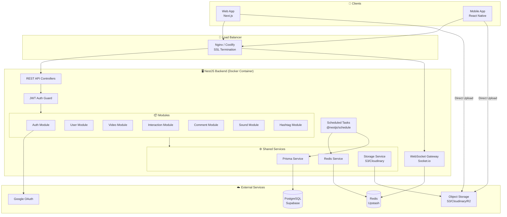
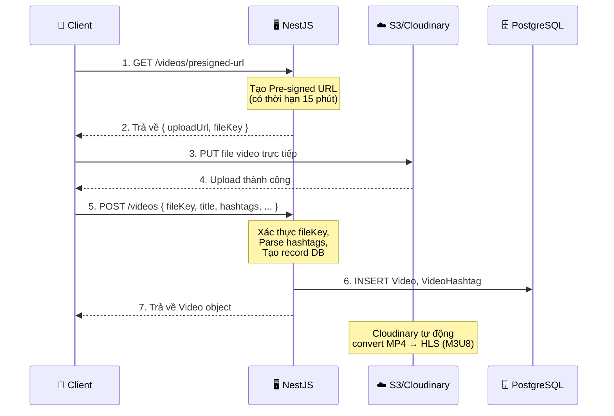
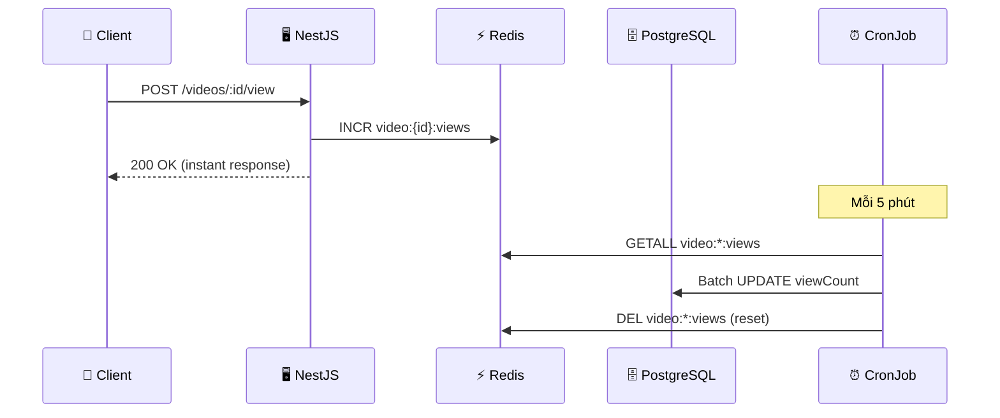
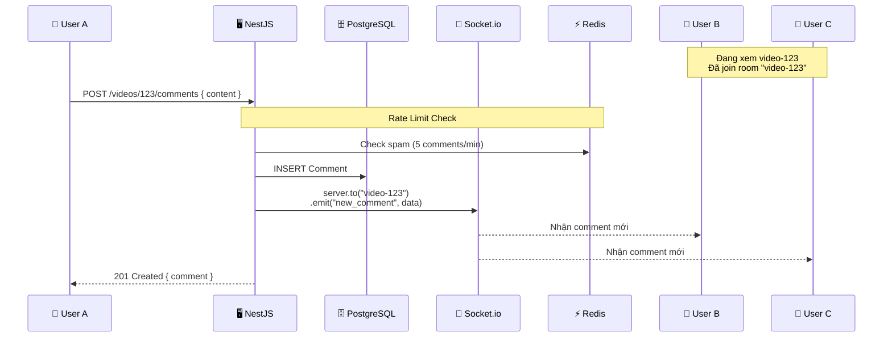
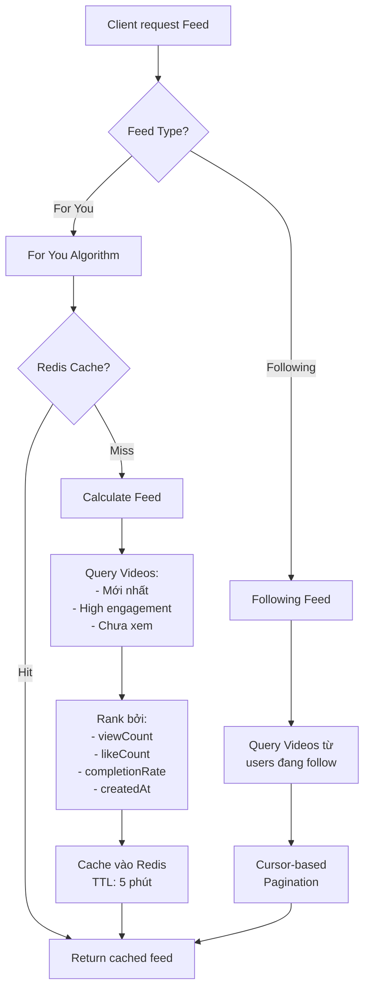
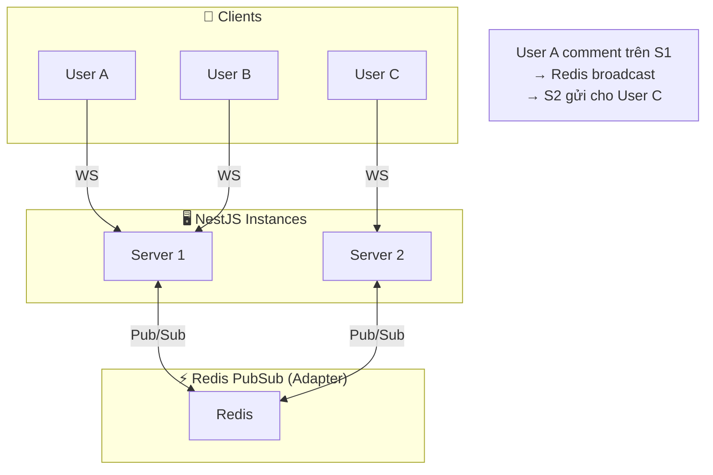

# 🏗️ Kiến Trúc Hệ Thống — TikTok Clone Backend

> **Nguồn gốc:** Tổng hợp từ [overview-project.md](./overview-project.md) và [detail-project.md](./detail-project.md)

---

## 1. System Architecture Overview



---

## 2. NestJS Module Architecture

```mermaid
graph TD
    APP[AppModule]
    
    APP --> CONFIG[ConfigModule<br/>@nestjs/config]
    APP --> AUTH_M[AuthModule]
    APP --> USER_M[UserModule]
    APP --> VIDEO_M[VideoModule]
    APP --> INTERACT_M[InteractionModule]
    APP --> COMMENT_M[CommentModule]
    APP --> SOUND_M[SoundModule]
    APP --> HASHTAG_M[HashtagModule]
    
    subgraph SharedModules["🔗 Shared Modules"]
        PRISMA_M[PrismaModule<br/>Global]
        REDIS_M[RedisModule<br/>Global]
        STORAGE_M[StorageModule<br/>Global]
    end
    
    APP --> SharedModules
    
    AUTH_M --> PRISMA_M
    AUTH_M --> REDIS_M
    USER_M --> PRISMA_M
    USER_M --> STORAGE_M
    VIDEO_M --> PRISMA_M
    VIDEO_M --> REDIS_M
    VIDEO_M --> STORAGE_M
    COMMENT_M --> PRISMA_M
    COMMENT_M --> REDIS_M
    INTERACT_M --> PRISMA_M
    INTERACT_M --> REDIS_M
```

---

## 3. Luồng dữ liệu chính (Data Flows)

### 3.1 Video Upload Flow



> [!IMPORTANT]
> Backend **KHÔNG nhận file video trực tiếp** để tránh:
> - Timeout (file video nặng)
> - Tiêu tốn bandwidth server
> - Tắc nghẽn khi nhiều user upload cùng lúc

### 3.2 Video View & Metrics Flow



### 3.3 Realtime Comment Flow



### 3.4 Feed Algorithm Flow



---

## 4. Socket.io Architecture



> [!NOTE]
> Redis Adapter cho Socket.io cho phép scale horizontal.
> Khi chạy nhiều server instances, mọi event đều được đồng bộ qua Redis Pub/Sub.

---

## 5. Folder Structure (Đề xuất)

```
src/
├── main.ts
├── app.module.ts
│
├── common/                    # Shared utilities
│   ├── decorators/            # Custom decorators (@CurrentUser, ...)
│   ├── filters/               # Exception filters (Global)
│   ├── guards/                # Auth guards (JwtGuard, ...)
│   ├── interceptors/          # Response interceptors
│   ├── pipes/                 # Validation pipes
│   └── dto/                   # Shared DTOs
│
├── config/                    # Configuration module
│   └── config.module.ts
│
├── prisma/                    # Prisma service (Global)
│   ├── prisma.module.ts
│   └── prisma.service.ts
│
├── redis/                     # Redis service (Global)
│   ├── redis.module.ts
│   └── redis.service.ts
│
├── storage/                   # S3/Cloudinary service (Global)
│   ├── storage.module.ts
│   └── storage.service.ts
│
├── auth/                      # Auth module
│   ├── auth.module.ts
│   ├── auth.controller.ts
│   ├── auth.service.ts
│   ├── strategies/            # Passport strategies
│   │   ├── jwt.strategy.ts
│   │   └── google.strategy.ts
│   └── dto/
│
├── user/                      # User module
│   ├── user.module.ts
│   ├── user.controller.ts
│   ├── user.service.ts
│   └── dto/
│
├── video/                     # Video module
│   ├── video.module.ts
│   ├── video.controller.ts
│   ├── video.service.ts
│   ├── feed.service.ts        # Feed algorithm
│   └── dto/
│
├── interaction/               # Like, Bookmark, Share
│   ├── interaction.module.ts
│   ├── interaction.controller.ts
│   ├── interaction.service.ts
│   └── dto/
│
├── comment/                   # Comment module (+ WebSocket)
│   ├── comment.module.ts
│   ├── comment.controller.ts
│   ├── comment.service.ts
│   ├── comment.gateway.ts     # Socket.io Gateway
│   └── dto/
│
├── sound/                     # Sound module
│   ├── sound.module.ts
│   ├── sound.controller.ts
│   ├── sound.service.ts
│   └── dto/
│
├── hashtag/                   # Hashtag module
│   ├── hashtag.module.ts
│   ├── hashtag.controller.ts
│   ├── hashtag.service.ts
│   └── dto/
│
└── tasks/                     # Scheduled tasks
    ├── tasks.module.ts
    └── tasks.service.ts       # CronJob: Redis → DB batch
```

---

## 6. Liên kết

| Tài liệu | Link |
|-----------|------|
| Tech Stack | [02-tech-stack.md](./02-tech-stack.md) |
| ERD & Schema | [04-erd-va-schema.md](./04-erd-va-schema.md) |
| Docker & Deploy | [06-docker-va-deployment.md](./06-docker-va-deployment.md) |
