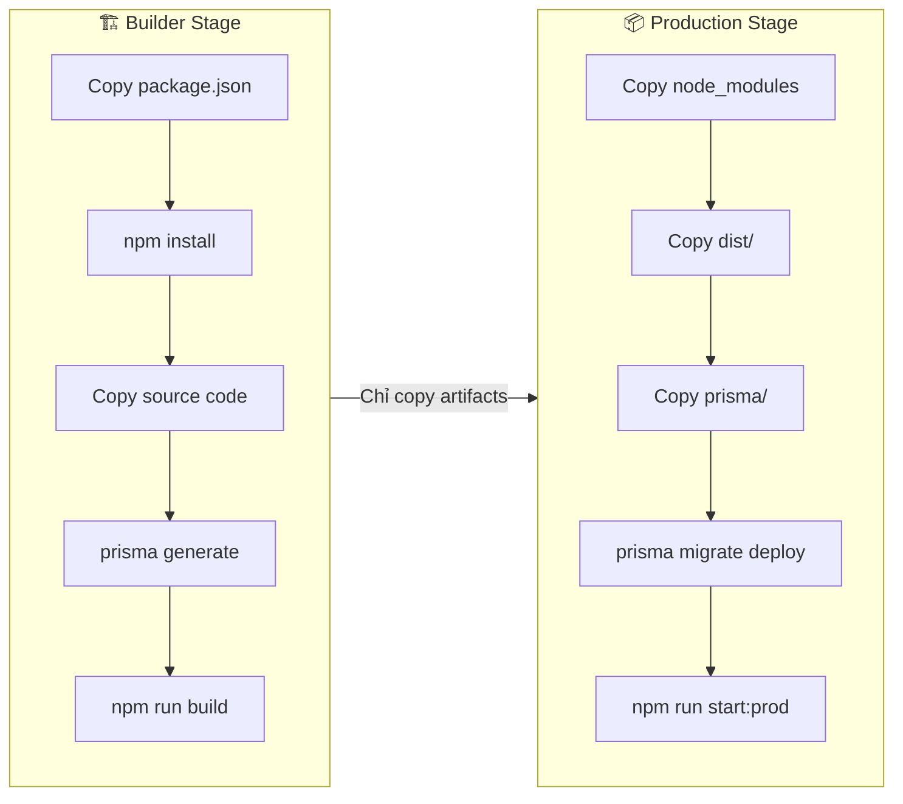
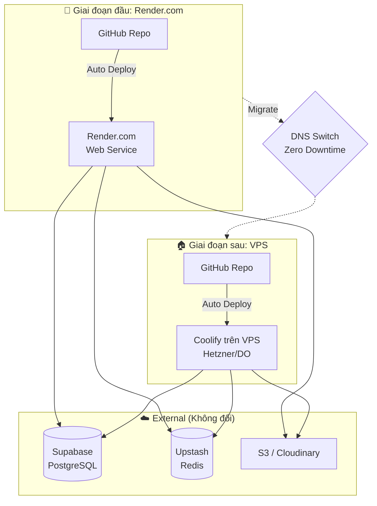
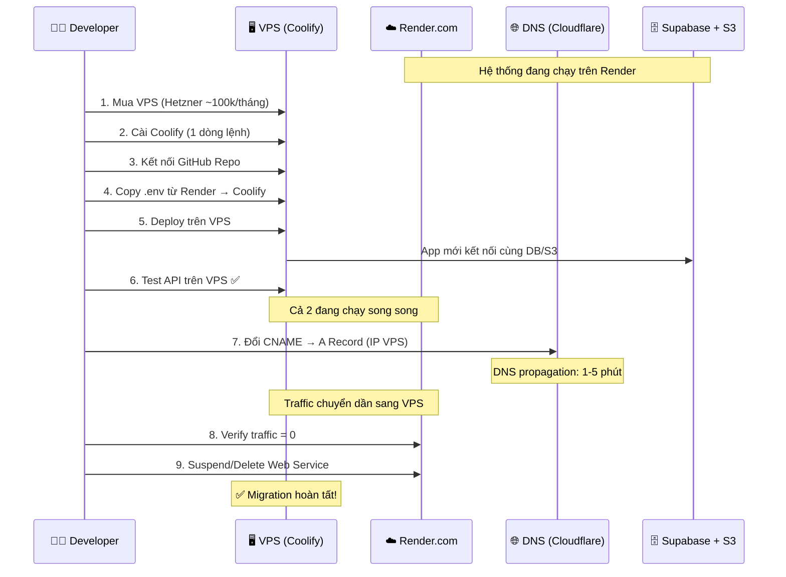

# 🐳 Docker & Deployment — TikTok Clone Backend

> **Nguồn gốc:** Tổng hợp từ [detail-project.md](./detail-project.md) mục 4 & [overview-project.md](./overview-project.md) Giai đoạn 3-4

---

## 1. Dockerfile (Multi-stage Build)

> **File gốc:** [detail-project.md](./detail-project.md) phần "File Dockerfile chuẩn cho NestJS"

```dockerfile
# ============================================
# Stage 1: Build
# ============================================
FROM node:18-alpine AS builder
WORKDIR /app

# Copy package files first (tận dụng Docker cache layer)
COPY package*.json ./
RUN npm install

# Copy source code
COPY . .

# Generate Prisma Client + Build NestJS
RUN npx prisma generate
RUN npm run build

# ============================================
# Stage 2: Production (Image nhẹ hơn ~70%)
# ============================================
FROM node:18-alpine
WORKDIR /app

# Chỉ copy những thứ cần thiết từ builder
COPY --from=builder /app/node_modules ./node_modules
COPY --from=builder /app/package*.json ./
COPY --from=builder /app/dist ./dist
COPY --from=builder /app/prisma ./prisma

EXPOSE 3000

# Auto migrate DB trước khi start app
CMD ["sh", "-c", "npx prisma migrate deploy && npm run start:prod"]
```

### Giải thích stages



> [!TIP]
> **Multi-stage build** giảm image size đáng kể:
> - Builder stage: ~800MB (có source code, dev dependencies)
> - Production stage: ~200MB (chỉ có compiled code)

---

## 2. Docker Compose (Local Development)

```yaml
# docker-compose.yml
version: '3.8'

services:
  # ===== App =====
  app:
    build: .
    ports:
      - "3000:3000"
    env_file:
      - .env
    depends_on:
      - postgres
      - redis
    volumes:
      - ./src:/app/src  # Hot reload (dev only)

  # ===== PostgreSQL (Local) =====
  postgres:
    image: postgres:15-alpine
    ports:
      - "5432:5432"
    environment:
      POSTGRES_DB: tiktok_db
      POSTGRES_USER: postgres
      POSTGRES_PASSWORD: postgres123
    volumes:
      - pgdata:/var/lib/postgresql/data

  # ===== Redis (Local) =====
  redis:
    image: redis:7-alpine
    ports:
      - "6379:6379"

volumes:
  pgdata:
```

---

## 3. Chiến Lược Deploy

### 3.1 Sơ đồ tổng quan



### 3.2 Deploy lên Render.com (Chi tiết)

| Bước | Hành động | Ghi chú |
|------|----------|---------|
| 1 | Push code lên GitHub | Commit & Push |
| 2 | Đăng nhập Render.com | render.com |
| 3 | Tạo **New Web Service** | Chọn repo GitHub |
| 4 | **Environment**: Docker | Render đọc `Dockerfile` |
| 5 | Nhập biến `.env` vào Dashboard | `DATABASE_URL`, `REDIS_URL`, `JWT_SECRET`... |
| 6 | Click **Deploy** | Đợi 2-3 phút build |
| 7 | Nhận URL: `tiktok-api.onrender.com` | Test API |
| 8 | Trỏ Custom Domain qua CNAME | `api.domain.com → xxx.onrender.com` |

> [!WARNING]
> **Render.com Free Tier** sẽ ngủ (sleep) sau 15 phút không có request.  
> Request đầu tiên sau khi ngủ sẽ mất ~30s để khởi động lại.

---

## 4. Migrate sang VPS — Zero Downtime

> **Chi tiết gốc:** [overview-project.md](./overview-project.md) Giai đoạn 4

### 4.1 Quy trình



### 4.2 Checklist Migrate

- [ ] **Bước 1:** Mua VPS (Hetzner/DigitalOcean)
- [ ] **Bước 2:** Cài Coolify: `curl -fsSL https://cdn.coollabs.io/coolify/install.sh | bash`
- [ ] **Bước 3:** Đăng nhập Coolify UI → Kết nối GitHub
- [ ] **Bước 4:** Tạo Project mới → Dán biến `.env` từ Render
- [ ] **Bước 5:** Deploy → Test API hoạt động
- [ ] **Bước 6:** Vào Cloudflare/Namecheap:
  - Xóa CNAME trỏ về Render
  - Thêm A Record trỏ về IP VPS
- [ ] **Bước 7:** Bật SSL/HTTPS trên Coolify
- [ ] **Bước 8:** Đợi DNS cập nhật (1-5 phút)
- [ ] **Bước 9:** Verify → Tắt Render

> [!IMPORTANT]
> **Tại sao Zero Downtime?**
> Vì Database (Supabase) và Storage (S3) nằm bên ngoài, cả Render và VPS đều trỏ vào cùng 1 nguồn dữ liệu.
> Trong lúc DNS chuyển đổi, user gọi API vào bên nào thì data vẫn nhất quán.

---

## 5. Liên kết

| Tài liệu | Link |
|-----------|------|
| Lộ trình Phases | [03-lo-trinh-phases.md](./03-lo-trinh-phases.md) |
| Environment Variables | [07-environment-variables.md](./07-environment-variables.md) |
| Kiến trúc hệ thống | [05-kien-truc-he-thong.md](./05-kien-truc-he-thong.md) |
