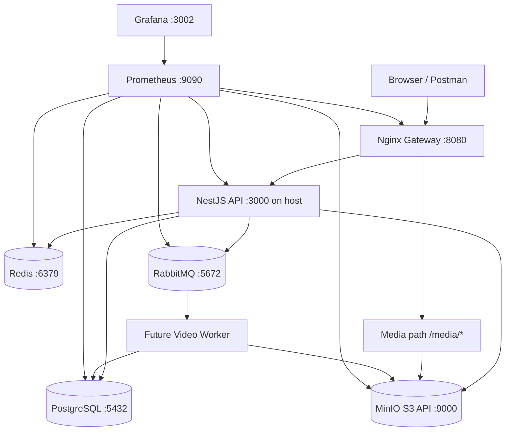

# Phase 9 - Local Microservices Lab

Mục tiêu của phase này là dựng một môi trường local giống production ở mức vừa đủ để học:

- API chạy sau gateway.
- Video upload qua MinIO, không đi xuyên qua backend.
- Redis dùng cho cache, rate limit, view counter.
- RabbitMQ dùng cho job async như transcode video.
- Prometheus + Grafana dùng để quan sát hệ thống.
- Nginx đóng vai trò API Gateway/load balancer đơn giản.

Ở bước đầu, ta chưa tách toàn bộ thành nhiều repo/service. Cách đi an toàn là:

1. Chạy backend NestJS hiện tại như `api-service`.
2. Dựng toàn bộ infra bằng Docker Compose.
3. Sau đó mới thêm `worker-service`.
4. Sau khi local ổn mới chuyển sang Kubernetes.

## 0. Sơ đồ local



## 1. File đã được tạo

| File | Ý nghĩa |
|---|---|
| `docker-compose.microservices.yml` | Dựng toàn bộ local infra. |
| `infra/nginx/nginx.conf` | Nginx gateway, route `/api/*` về backend và `/media/*` về MinIO. |
| `infra/prometheus/prometheus.yml` | Danh sách targets Prometheus sẽ scrape metrics. |
| `infra/prometheus/alert.rules.yml` | Alert mẫu cho target down và RabbitMQ backlog. |
| `infra/grafana/provisioning/datasources/prometheus.yml` | Tự add Prometheus datasource vào Grafana. |
| `infra/grafana/provisioning/dashboards/dashboards.yml` | Tự load dashboard JSON. |
| `infra/grafana/dashboards/local-lab-overview.json` | Dashboard local lab cơ bản. |
| `backend/.env.microservices.example` | Env mẫu để backend kết nối Postgres, Redis, RabbitMQ, MinIO local. |

## 2. Chuẩn bị máy

Bạn cần:

- Docker Desktop đang chạy.
- Node.js + npm.
- Port còn trống: `5432`, `6379`, `5672`, `15672`, `15692`, `9000`, `9001`, `8080`, `9090`, `3002`.

Ý nghĩa:

- Docker chạy các service phụ trợ để máy bạn không cần cài Postgres/Redis/RabbitMQ/MinIO trực tiếp.
- Backend vẫn chạy bằng `npm run start:dev` để bạn debug code dễ hơn.

## 3. Start local infra

Ở thư mục root repo:

```powershell
docker compose -f docker-compose.microservices.yml up -d
```

Ý nghĩa:

- `-f docker-compose.microservices.yml`: dùng file compose lab mới.
- `up`: tạo và chạy các container.
- `-d`: chạy background.

Kiểm tra:

```powershell
docker compose -f docker-compose.microservices.yml ps
```

Bạn muốn thấy các service chính ở trạng thái `running` hoặc `healthy`.

## 4. Các URL cần nhớ

| Service | URL | Login |
|---|---|---|
| Nginx gateway | `http://localhost:8080` | Không cần |
| Backend trực tiếp | `http://localhost:3000` | Không cần |
| MinIO console | `http://localhost:9001` | `tiktok` / `tiktok123` |
| RabbitMQ console | `http://localhost:15672` | `tiktok` / `tiktok123` |
| Prometheus | `http://localhost:9090` | Không cần |
| Grafana | `http://localhost:3002` | `admin` / `admin` |

Ghi nhớ:

- Gọi API qua gateway: `http://localhost:8080/api/...`
- Gọi API trực tiếp khi debug: `http://localhost:3000/api/...`
- File public từ MinIO đi qua: `http://localhost:8080/media/...`

## 5. Tạo env cho backend

Copy file env mẫu:

```powershell
Copy-Item backend\.env.microservices.example backend\.env
```

Ý nghĩa:

- Backend đọc `.env`.
- `DATABASE_URL` trỏ về Postgres local.
- `REDIS_URL` trỏ về Redis local.
- `RABBITMQ_URL` trỏ về RabbitMQ local.
- Các biến `AWS_*` dùng MinIO vì MinIO tương thích S3 API.

Phần quan trọng nhất:

```env
AWS_S3_BUCKET=tiktok-videos
AWS_S3_ENDPOINT=http://localhost:9000
AWS_S3_PUBLIC_URL=http://localhost:8080/media
```

Ý nghĩa:

- `AWS_S3_ENDPOINT`: backend dùng endpoint này để tạo presigned upload URL.
- `AWS_S3_PUBLIC_URL`: URL public client dùng để xem video sau khi upload.
- Nginx map `/media/*` sang bucket `tiktok-videos` trong MinIO.

## 6. Cài dependency và migrate database

```powershell
cd backend
npm install
npx prisma generate
npx prisma migrate deploy
```

Ý nghĩa:

- `npm install`: cài dependency backend.
- `prisma generate`: sinh Prisma Client từ `schema.prisma`.
- `prisma migrate deploy`: apply migration có sẵn vào Postgres local.

Nếu bạn đang dev schema mới và muốn tạo migration mới:

```powershell
npx prisma migrate dev
```

## 7. Chạy backend API

Trong thư mục `backend`:

```powershell
npm run start:dev
```

Ý nghĩa:

- Backend chạy ở `http://localhost:3000`.
- Nginx trong Docker sẽ forward `http://localhost:8080/api/*` về backend này.

Test nhanh:

```powershell
Invoke-WebRequest http://localhost:8080/health
```

Kết quả mong đợi:

```text
ok
```

## 8. Test gateway route vào API

Ví dụ register qua gateway:

```powershell
Invoke-RestMethod `
  -Method Post `
  -Uri http://localhost:8080/api/auth/register `
  -ContentType "application/json" `
  -Body '{"email":"test@example.com","password":"Test1234","username":"testuser","displayName":"Test User"}'
```

Ý nghĩa:

- Client không gọi backend trực tiếp.
- Client đi qua Nginx gateway.
- Nginx forward request tới NestJS API.

## 9. Test MinIO bucket

Mở:

```text
http://localhost:9001
```

Login:

```text
tiktok / tiktok123
```

Bạn sẽ thấy bucket:

```text
tiktok-videos
```

Bucket này được tạo bởi service `createbuckets`.

## 10. Test presigned upload flow

Sau khi login/register lấy `accessToken`, gọi:

```powershell
Invoke-RestMethod `
  -Method Get `
  -Uri "http://localhost:8080/api/videos/presigned-url?contentType=video/mp4" `
  -Headers @{ Authorization = "Bearer <ACCESS_TOKEN>" }
```

Backend sẽ trả:

```json
{
  "uploadUrl": "...",
  "fileKey": "videos/<userId>/<uuid>.mp4",
  "expiresInSeconds": 900
}
```

Ý nghĩa:

- Client upload file trực tiếp lên MinIO bằng `uploadUrl`.
- Backend không nhận file nặng.
- Sau upload, client gọi `POST /api/videos` để confirm metadata.

## 11. Prometheus

Mở:

```text
http://localhost:9090/targets
```

Bạn sẽ thấy các target:

- `nginx`
- `postgres`
- `redis`
- `rabbitmq`
- `minio`
- `api-service`

Lưu ý:

- `api-service` có thể đang `DOWN` ở bước này vì backend chưa có endpoint `/metrics`.
- Đây là việc sẽ làm ở bước tiếp theo: thêm Prometheus metrics vào NestJS để track HTTP `200`, `400`, `500`, latency, memory.

## 12. Grafana

Mở:

```text
http://localhost:3002
```

Login:

```text
admin / admin
```

Vào:

```text
Dashboards -> TikTokWeb -> TikTokWeb Local Lab Overview
```

Ý nghĩa:

- Grafana đã tự nhận Prometheus datasource.
- Dashboard được load từ file JSON trong repo.
- Bạn có thể sửa dashboard trên UI, sau đó export JSON lại vào repo.

## 13. RabbitMQ

Mở:

```text
http://localhost:15672
```

Login:

```text
tiktok / tiktok123
```

Ý nghĩa:

- RabbitMQ sẽ dùng cho job async.
- API publish message kiểu `video.transcode.requested`.
- Worker consume message, chạy FFmpeg, lưu HLS vào MinIO, update DB.

Chưa cần code worker ở bước này. Mục tiêu bước này là hiểu infra và có RabbitMQ chạy ổn.

## 14. Dừng môi trường

Dừng container nhưng giữ data:

```powershell
docker compose -f docker-compose.microservices.yml down
```

Xóa cả data volume để làm lại từ đầu:

```powershell
docker compose -f docker-compose.microservices.yml down -v
```

Ý nghĩa:

- `down`: tắt và xóa container/network.
- `-v`: xóa cả volume Postgres/Redis/RabbitMQ/MinIO/Prometheus/Grafana.

## 15. Thứ tự học tiếp theo

### Step 2 - Add metrics vào NestJS

Mục tiêu:

- Endpoint `/metrics`.
- Track số request theo route/status: `200`, `400`, `401`, `500`.
- Track latency p50/p95/p99.
- Track process memory/CPU.

Tech nên dùng:

- `prom-client`
- NestJS middleware hoặc interceptor.

### Step 3 - Add RabbitMQ producer + worker

Mục tiêu:

- API publish transcode job.
- Worker consume job.
- Worker chạy FFmpeg.
- Worker update video status: `PENDING -> PROCESSING -> READY/FAILED`.

Tech nên dùng:

- `amqplib` hoặc `@golevelup/nestjs-rabbitmq`.
- Worker NestJS app riêng hoặc Node process riêng.

### Step 4 - Dockerize API + Worker

Mục tiêu:

- Không cần chạy `npm run start:dev` trên host nữa.
- Compose chạy được `api` và `worker` như service độc lập.

### Step 5 - Kubernetes local

Mục tiêu:

- Chạy bằng `kind`, `k3d`, hoặc `minikube`.
- Deploy API/Worker/Ingress/ConfigMap/Secret.
- Infra có thể dùng Helm chart: PostgreSQL, Redis, RabbitMQ, MinIO, kube-prometheus-stack.

### Step 6 - CI/CD

Mục tiêu:

- GitHub Actions chạy build/test.
- Build Docker image.
- Push image lên GHCR.
- Deploy tự động lên Docker host hoặc Kubernetes.

## 16. Không nên làm ngay

Chưa cần:

- Service mesh như Istio/Linkerd.
- Kafka.
- Multi-region.
- CDN thật.
- Database-per-service nghiêm ngặt.
- Canary deployment phức tạp.

Lý do:

- Mục tiêu hiện tại là học luồng production cơ bản thật chắc.
- Khi API + Worker + Gateway + Observability chạy ổn, các phần trên sẽ dễ hiểu hơn nhiều.

## 17. Trạng thái repo hiện tại

Local lab hiện có thể chạy trọn bộ bằng Docker Compose:

```powershell
docker compose -f docker-compose.microservices.yml up -d --build
```

Các service bổ sung so với bản hướng dẫn ban đầu:

- `api`: NestJS API chạy trong container ở `http://localhost:3000`.
- `frontend`: React production build chạy ở `http://localhost:3001`.
- Nginx gọi API qua Docker network (`api:3000`) thay vì phụ thuộc dev server trên host.
- API có endpoint Prometheus `http://localhost:3000/metrics`.
- Presigned upload dùng endpoint browser `http://localhost:9000`, trong khi API vẫn dùng `http://minio:9000` cho kết nối nội bộ.

Các luồng backend đã có:

- Auth local: register, login, refresh token, logout.
- User profile, search, follow/unfollow.
- Video feed, following feed, presigned upload, publish metadata, view counter, delete.
- Like/unlike, bookmark/remove bookmark, danh sách bookmark.
- Comment, reply, delete comment, rate limit và Socket.IO room.
- Sound, hashtag, Redis view batching và Prometheus metrics.

Các phần vẫn là phase tiếp theo:

- RabbitMQ producer và video worker dùng FFmpeg.
- Trạng thái transcode `PENDING -> PROCESSING -> READY/FAILED`.
- Notification API/UI hoàn chỉnh.
- HLS assets thật cho dữ liệu demo.

## 18. Bật Google SSO local

Google SSO dùng Google Identity Services ở frontend và gửi `idToken` tới
`POST /api/auth/google`.

Đặt cùng một Google OAuth Web Client ID ở hai file:

```env
# backend/.env
GOOGLE_CLIENT_ID=your_client_id.apps.googleusercontent.com

# frontend/.env
REACT_APP_GOOGLE_CLIENT_ID=your_client_id.apps.googleusercontent.com
```

Trong Google Cloud Console, thêm authorized JavaScript origin:

```text
http://localhost:3001
```

Sau khi thay đổi biến frontend, cần build lại vì CRA nhúng biến môi trường vào
static bundle:

```powershell
docker compose -f docker-compose.microservices.yml up -d --build api frontend
```
