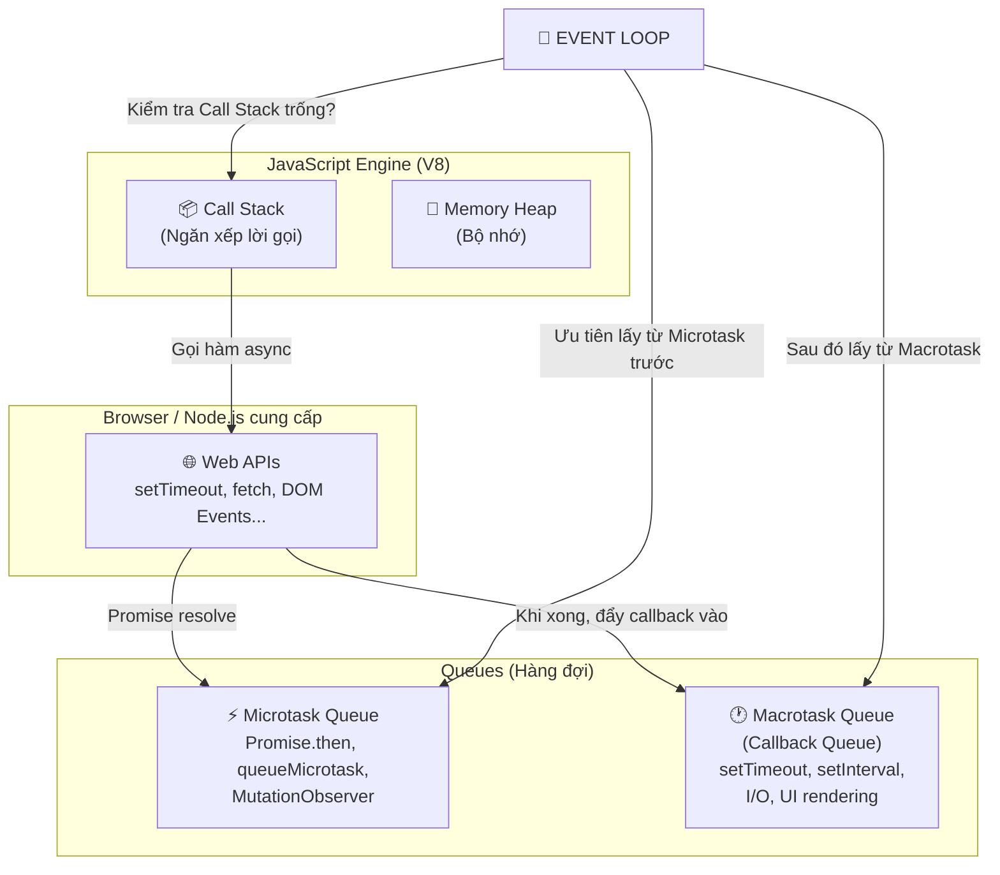
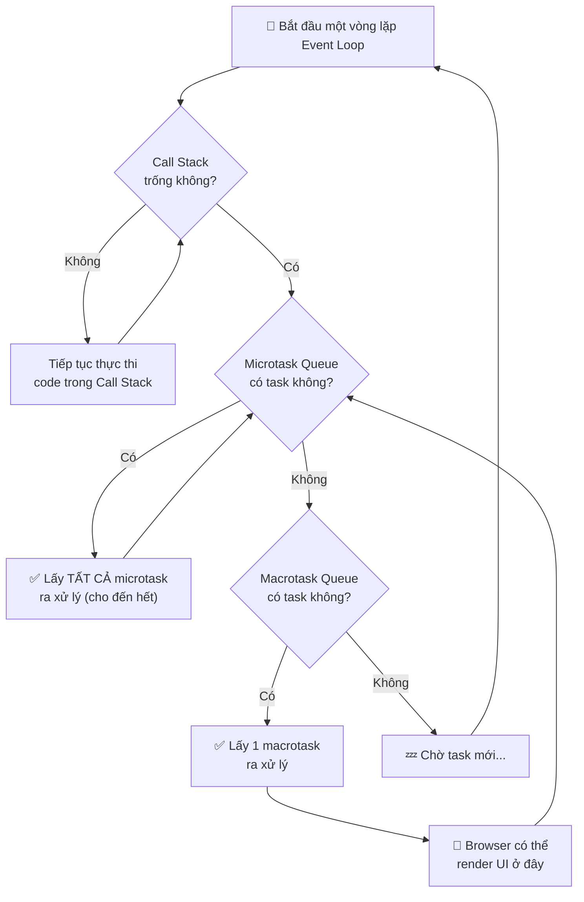

# Event Loop, Call Stack, Microtask & Macrotask — Giải thích Chuyên sâu

> [!IMPORTANT]
> Đây là một trong những câu hỏi **"kinh điển"** và **khó nhất** trong phỏng vấn JavaScript. Hiểu sâu Event Loop giúp bạn giải thích được tại sao `setTimeout(..., 0)` lại chạy **sau** `Promise.then()`, và tại sao JavaScript **single-threaded** nhưng vẫn xử lý được bất đồng bộ (asynchronous).

---

## 1. Bức tranh tổng quan — JavaScript Runtime



### Các thành phần chính:

| Thành phần | Vai trò |
|---|---|
| **Call Stack** | Ngăn xếp chứa các hàm đang thực thi. JS là single-threaded → chỉ có **1 Call Stack** |
| **Memory Heap** | Nơi lưu trữ biến, object trong bộ nhớ |
| **Web APIs** | Các API do **trình duyệt** (hoặc Node.js) cung cấp, **KHÔNG** phải của JS Engine. Ví dụ: `setTimeout`, `fetch`, `addEventListener` |
| **Microtask Queue** | Hàng đợi ưu tiên cao: `Promise.then()`, `queueMicrotask()`, `MutationObserver` |
| **Macrotask Queue** | Hàng đợi ưu tiên thấp hơn: `setTimeout`, `setInterval`, `setImmediate` (Node), I/O callbacks |
| **Event Loop** | Cơ chế "vòng lặp" liên tục kiểm tra Call Stack và chuyển task từ Queue vào Stack |

---

## 2. Call Stack — Ngăn xếp lời gọi hàm

Call Stack hoạt động theo nguyên tắc **LIFO (Last In, First Out)** — hàm vào sau thì ra trước.

```javascript
function third()  { console.log("3️⃣ Third"); }
function second() { third(); console.log("2️⃣ Second"); }
function first()  { second(); console.log("1️⃣ First"); }

first();
```

**Mô phỏng Call Stack:**

```
Bước 1: [first]              ← first() được push vào
Bước 2: [first, second]      ← second() được push vào
Bước 3: [first, second, third] ← third() được push vào
Bước 4: [first, second]      ← third() chạy xong, pop ra → in "3️⃣ Third"
Bước 5: [first]              ← second() chạy xong, pop ra → in "2️⃣ Second"
Bước 6: []                   ← first() chạy xong, pop ra → in "1️⃣ First"
```

**Output:**
```
3️⃣ Third
2️⃣ Second
1️⃣ First
```

> [!NOTE]
> Khi Call Stack bị quá tải (ví dụ gọi đệ quy vô hạn), bạn sẽ gặp lỗi **"Maximum call stack size exceeded"** — hay còn gọi là **Stack Overflow**.

---

## 3. Event Loop — Trái tim của Async JavaScript

### 3.1. Tại sao cần Event Loop?

JavaScript là **single-threaded** (chỉ có 1 luồng xử lý). Nếu không có Event Loop, mọi thao tác tốn thời gian (gọi API, đọc file, setTimeout) sẽ **block** toàn bộ chương trình → giao diện đứng cứng, không tương tác được.

**Event Loop giải quyết bằng cách:**
1. Các thao tác async được **ủy quyền** cho Web APIs (browser) hoặc libuv (Node.js) xử lý ở **background**.
2. Khi xong, callback được đẩy vào **Queue** (hàng đợi).
3. Event Loop liên tục kiểm tra: **"Call Stack trống chưa?"** → Nếu trống, lấy task từ Queue đẩy vào Stack để thực thi.

### 3.2. Quy tắc vàng của Event Loop



> [!CAUTION]
> **Quy tắc quan trọng nhất:**
> 1. **Synchronous code (code đồng bộ)** luôn chạy **TRƯỚC** mọi thứ async.
> 2. Sau mỗi macrotask, Event Loop sẽ **xử lý HẾT** microtask queue trước khi lấy macrotask tiếp theo.
> 3. Microtask có thể **sinh thêm** microtask → tất cả đều được xử lý trước khi sang macrotask kế tiếp.
> 4. Browser **chỉ render UI** giữa các macrotask (sau khi microtask queue trống).

---

## 4. Microtask vs Macrotask — Phân biệt rõ ràng

### 4.1. Bảng so sánh

| | ⚡ Microtask | 🕐 Macrotask |
|---|---|---|
| **Ưu tiên** | **CAO** (chạy trước) | **THẤP** (chạy sau) |
| **Ví dụ** | `Promise.then/catch/finally`, `queueMicrotask()`, `MutationObserver`, `await` (phần sau await) | `setTimeout`, `setInterval`, `setImmediate` (Node), `requestAnimationFrame`*, I/O, UI events |
| **Xử lý** | Toàn bộ queue được xử lý **hết sạch** trước khi chuyển sang macrotask | Chỉ xử lý **1 task** mỗi vòng lặp |
| **Rủi ro** | Nếu microtask sinh microtask vô hạn → **block UI vĩnh viễn** | Không block vì chỉ lấy 1 task/vòng |

> [!NOTE]
> `requestAnimationFrame` (rAF) thực tế nằm ở một queue riêng, chạy **trước** bước render của browser. Nhưng trong phỏng vấn, bạn có thể phân loại nó gần với macrotask.

### 4.2. Ví dụ kinh điển — setTimeout vs Promise

```javascript
console.log("1️⃣ Start");

setTimeout(() => {
  console.log("2️⃣ setTimeout");
}, 0);

Promise.resolve().then(() => {
  console.log("3️⃣ Promise");
});

console.log("4️⃣ End");
```

**Output:**
```
1️⃣ Start
4️⃣ End
3️⃣ Promise
2️⃣ setTimeout
```

**Giải thích từng bước:**

| Bước | Hành động | Call Stack | Microtask Queue | Macrotask Queue |
|---|---|---|---|---|
| 1 | Chạy `console.log("Start")` | `[log]` | `[]` | `[]` |
| 2 | Gặp `setTimeout` → đẩy callback cho **Web API** | `[]` | `[]` | `[cb_timeout]` |
| 3 | Gặp `Promise.resolve().then()` → callback vào **Microtask Queue** | `[]` | `[cb_promise]` | `[cb_timeout]` |
| 4 | Chạy `console.log("End")` | `[log]` | `[cb_promise]` | `[cb_timeout]` |
| 5 | **Call Stack trống** → Event Loop kiểm tra **Microtask trước** → lấy `cb_promise` ra chạy → in `"Promise"` | `[cb_promise]` | `[]` | `[cb_timeout]` |
| 6 | Microtask Queue trống → lấy **Macrotask** → `cb_timeout` → in `"setTimeout"` | `[cb_timeout]` | `[]` | `[]` |

---

## 5. Async/Await — Đường cú pháp của Promise

`async/await` thực chất là **syntax sugar** trên Promise. Khi gặp `await`, phần code **phía sau** nó được đưa vào **Microtask Queue** (tương đương `.then()`).

```javascript
async function foo() {
  console.log("1️⃣ Trước await");
  await Promise.resolve();
  console.log("2️⃣ Sau await"); // ← Dòng này = .then() → Microtask
}

console.log("3️⃣ Trước foo");
foo();
console.log("4️⃣ Sau foo");
```

**Output:**
```
3️⃣ Trước foo
1️⃣ Trước await
4️⃣ Sau foo
2️⃣ Sau await
```

**Giải thích:**
1. `console.log("Trước foo")` → chạy ngay (sync)
2. Gọi `foo()` → vào hàm, chạy `console.log("Trước await")` (sync)
3. Gặp `await` → **tạm dừng** hàm `foo`, phần sau `await` đẩy vào **Microtask Queue**
4. Quay lại code bên ngoài → `console.log("Sau foo")` (sync)
5. Call Stack trống → lấy microtask → chạy `console.log("Sau await")`

> [!TIP]
> **Mẹo nhớ:** Khi gặp `await`, hãy tưởng tượng JS **cắt hàm làm đôi** tại điểm `await`. Nửa trên chạy sync, nửa dưới chạy như `.then()`.

---

## 6. Các bài Quiz phỏng vấn — Từ dễ đến khó

### Quiz 1: Cơ bản

```javascript
console.log("A");

setTimeout(() => console.log("B"), 0);

Promise.resolve()
  .then(() => console.log("C"))
  .then(() => console.log("D"));

console.log("E");
```

<details>
<summary>👉 Xem đáp án</summary>

```
A → E → C → D → B
```

**Giải thích:**
- `A`, `E`: Sync → chạy trước
- `C`: Microtask (`.then` thứ 1) → chạy tiếp
- `D`: Microtask (`.then` thứ 2, được tạo **sau** khi `.then` thứ 1 resolve) → vẫn chạy trước macrotask
- `B`: Macrotask (`setTimeout`) → chạy cuối cùng

</details>

---

### Quiz 2: Microtask sinh Microtask

```javascript
console.log("Start");

setTimeout(() => {
  console.log("Timeout 1");
  Promise.resolve().then(() => console.log("Promise inside Timeout"));
}, 0);

setTimeout(() => {
  console.log("Timeout 2");
}, 0);

Promise.resolve()
  .then(() => {
    console.log("Promise 1");
    return Promise.resolve();
  })
  .then(() => {
    console.log("Promise 2");
  });

console.log("End");
```

<details>
<summary>👉 Xem đáp án</summary>

```
Start
End
Promise 1
Promise 2
Timeout 1
Promise inside Timeout
Timeout 2
```

**Giải thích:**
1. **Sync:** `Start`, `End`
2. **Microtask:** `Promise 1` → `Promise 2` (chain `.then` → microtask sinh microtask → xử lý hết)
3. **Macrotask 1:** `Timeout 1` → bên trong tạo thêm microtask `"Promise inside Timeout"`
4. **Microtask** (sau macrotask 1): `Promise inside Timeout`
5. **Macrotask 2:** `Timeout 2`

> Quy tắc: Sau **MỖI** macrotask, Event Loop quét **HẾT** microtask queue.

</details>

---

### Quiz 3: async/await phức tạp 🔥

```javascript
async function async1() {
  console.log("async1 start");
  await async2();
  console.log("async1 end");
}

async function async2() {
  console.log("async2");
}

console.log("script start");

setTimeout(() => {
  console.log("setTimeout");
}, 0);

async1();

new Promise((resolve) => {
  console.log("promise1");
  resolve();
}).then(() => {
  console.log("promise2");
});

console.log("script end");
```

<details>
<summary>👉 Xem đáp án</summary>

```
script start
async1 start
async2
promise1
script end
async1 end
promise2
setTimeout
```

**Giải thích chi tiết:**

| Giai đoạn | Code | Lý do |
|---|---|---|
| **Sync** | `script start` | `console.log` đầu tiên |
| **Sync** | `async1 start` | Gọi `async1()`, code trước `await` chạy sync |
| **Sync** | `async2` | `await async2()` → `async2()` chạy sync (phần trước return) |
| **Sync** | `promise1` | Executor của `new Promise(...)` chạy **ĐỒNG BỘ** |
| **Sync** | `script end` | `console.log` cuối script |
| **Microtask** | `async1 end` | Phần sau `await` của `async1` |
| **Microtask** | `promise2` | `.then()` của Promise |
| **Macrotask** | `setTimeout` | Chạy cuối cùng |

> ⚠️ **Lưu ý quan trọng:** Executor function (hàm bên trong `new Promise((resolve) => {...})`) luôn chạy **ĐỒNG BỘ**. Chỉ `.then()` mới là async (microtask).

</details>

---

### Quiz 4: Quiz "ác mộng" 😈

```javascript
console.log(1);

setTimeout(() => console.log(2), 0);

Promise.resolve()
  .then(() => {
    console.log(3);
    setTimeout(() => console.log(4), 0);
  })
  .then(() => console.log(5));

setTimeout(() => {
  console.log(6);
  Promise.resolve().then(() => console.log(7));
}, 0);

console.log(8);
```

<details>
<summary>👉 Xem đáp án</summary>

```
1
8
3
5
2
6
7
4
```

**Giải thích:**
1. **Sync:** `1`, `8`
2. **Microtask round 1:** `3` (`.then` đầu tiên) → bên trong đẩy `setTimeout(4)` vào macrotask queue
3. **Microtask round 1 (tiếp):** `5` (`.then` thứ 2, được sinh từ `.then` đầu)
4. **Macrotask 1:** `2` (`setTimeout` đầu tiên, đăng ký trước)
5. **Macrotask 2:** `6` (`setTimeout` thứ hai) → bên trong tạo microtask `7`
6. **Microtask** (sau macrotask 2): `7`
7. **Macrotask 3:** `4` (`setTimeout` được đăng ký bên trong `.then` ở bước 2 → vào queue muộn nhất)

</details>

---

## 7. Ứng dụng thực tế trong dự án

### 7.1. `queueMicrotask()` — Khi cần chạy trước render

```javascript
// Cần update state trước khi browser repaint
queueMicrotask(() => {
  // Code ở đây chạy TRƯỚC browser render
  // Hữu ích khi cần đảm bảo DOM update trước khi user nhìn thấy
  element.style.opacity = "1";
});
```

### 7.2. Tránh block UI khi xử lý dữ liệu lớn

```javascript
// ❌ Block UI - Long task
function processHugeArray(data) {
  data.forEach(item => heavyComputation(item)); // Block 5 giây
}

// ✅ Chia nhỏ bằng setTimeout → cho browser render giữa các chunk
function processWithChunks(data, chunkSize = 100) {
  let index = 0;
  
  function processChunk() {
    const end = Math.min(index + chunkSize, data.length);
    
    for (let i = index; i < end; i++) {
      heavyComputation(data[i]);
    }
    
    index = end;
    
    if (index < data.length) {
      // Dùng setTimeout → tạo macrotask → browser có cơ hội render UI
      setTimeout(processChunk, 0);
    }
  }
  
  processChunk();
}
```

### 7.3. Liên hệ với React

```javascript
// React batches state updates trong microtask (kể từ React 18)
function handleClick() {
  setCount(c => c + 1);  // ← Không re-render ngay
  setFlag(f => !f);       // ← Không re-render ngay
  setText("updated");     // ← Không re-render ngay
  // React batch cả 3 → CHỈ 1 re-render (nhờ Automatic Batching)
}

// Nhưng trong setTimeout (React 17 trở xuống):
setTimeout(() => {
  setCount(c => c + 1);  // ← Re-render 1 (React 17)
  setFlag(f => !f);       // ← Re-render 2 (React 17)
  // React 18+: vẫn batch → chỉ 1 re-render ✅
}, 0);
```

---

## 8. Cách trả lời phỏng vấn — Mẫu câu trả lời

> [!TIP]
> **Mẫu trả lời khi được hỏi "Giải thích Event Loop trong JavaScript":**
>
> *"JavaScript là ngôn ngữ single-threaded, nghĩa là chỉ có một Call Stack để thực thi code. Tuy nhiên, nhờ Event Loop, nó vẫn xử lý được các tác vụ bất đồng bộ.*
>
> *Cơ chế hoạt động gồm 3 phần chính:*
> 1. *Khi gặp tác vụ async như `setTimeout` hay `fetch`, JavaScript ủy quyền cho Web APIs (thuộc browser) xử lý ở background.*
> 2. *Khi tác vụ hoàn thành, callback được đẩy vào hàng đợi — có 2 loại: **Microtask Queue** (ưu tiên cao, ví dụ: `.then()`) và **Macrotask Queue** (ưu tiên thấp, ví dụ: `setTimeout`).*
> 3. *Event Loop liên tục kiểm tra: khi Call Stack trống, nó sẽ lấy **tất cả microtask** xử lý trước, rồi mới lấy **1 macrotask**, sau đó lại quét microtask... và lặp lại.*
>
> *Ví dụ cụ thể: `setTimeout(fn, 0)` không chạy ngay sau 0ms mà phải chờ Call Stack trống VÀ mọi microtask xử lý xong. Đó là lý do `Promise.then()` luôn chạy trước `setTimeout`."*

---

## 9. Tổng kết — Bản đồ tư duy

```
JavaScript Runtime
├── Call Stack (LIFO) ← Chạy code đồng bộ
│
├── Web APIs (Browser cung cấp)
│   ├── setTimeout / setInterval → callback → Macrotask Queue
│   ├── fetch / XMLHttpRequest → callback → Macrotask Queue
│   └── Promise (resolve/reject) → .then() → Microtask Queue
│
├── Microtask Queue ⚡ (ƯU TIÊN CAO)
│   ├── Promise.then / catch / finally
│   ├── queueMicrotask()
│   ├── MutationObserver
│   └── async/await (phần sau await)
│
├── Macrotask Queue 🕐 (ƯU TIÊN THẤP)
│   ├── setTimeout / setInterval
│   ├── setImmediate (Node.js)
│   ├── I/O callbacks
│   └── UI rendering events
│
└── Event Loop 🔄
    ├── 1. Chạy hết code Sync trong Call Stack
    ├── 2. Xử lý HẾT Microtask Queue
    ├── 3. Browser render (nếu cần)
    ├── 4. Lấy 1 Macrotask → chạy
    └── 5. Quay lại bước 2...
```

> [!IMPORTANT]
> **3 điều PHẢI nhớ khi phỏng vấn:**
> 1. **Sync trước, Async sau** — Code đồng bộ LUÔN chạy trước hết (kể cả executor của `new Promise()`).
> 2. **Micro trước, Macro sau** — `Promise.then()` luôn chạy trước `setTimeout(..., 0)`.
> 3. **Sau mỗi Macro, quét hết Micro** — Sau mỗi macrotask, Event Loop xử lý **toàn bộ** microtask queue trước khi lấy macrotask tiếp.
