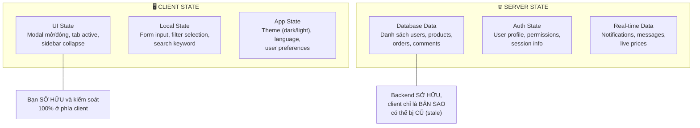
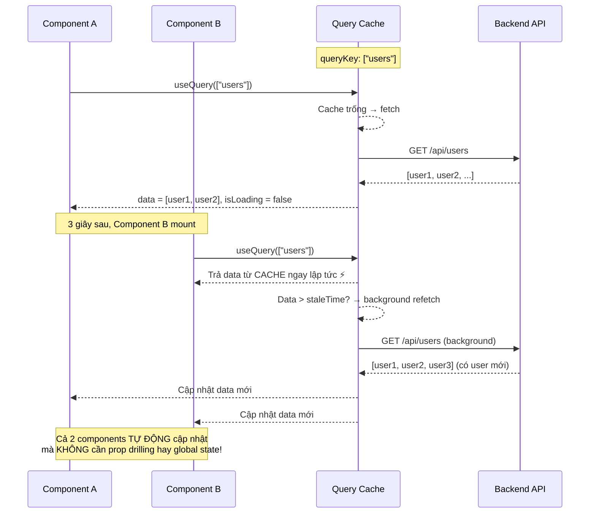
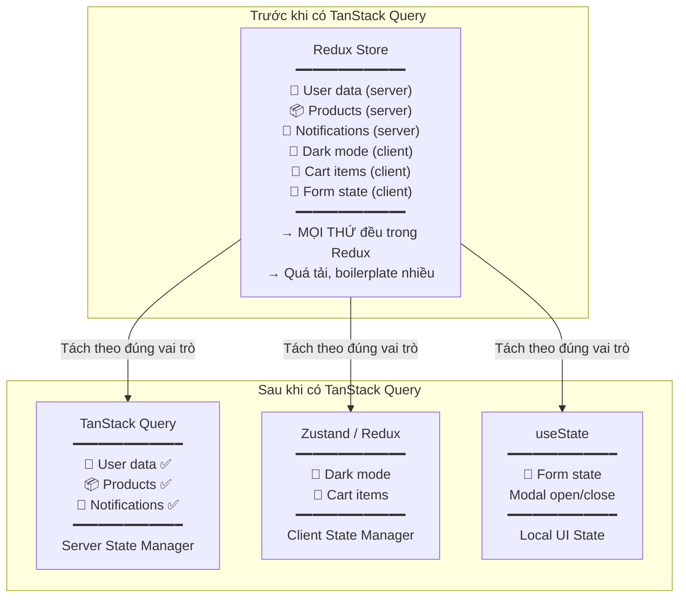
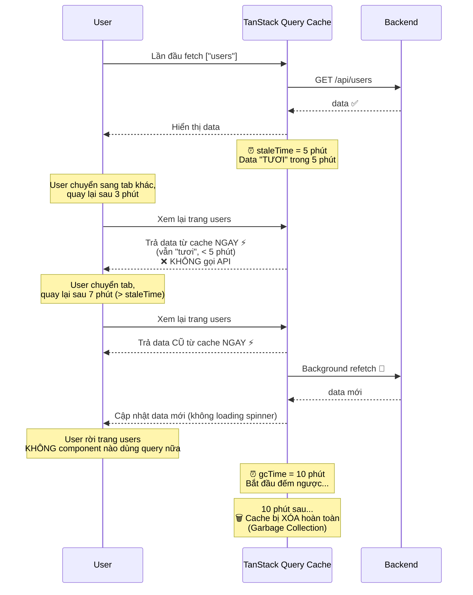

# Quản lý Data Fetching — TanStack Query vs Global State & Client State vs Server State

> [!IMPORTANT]
> Đây là câu hỏi phỏng vấn **phân loại level Mid/Senior**: "TanStack Query có thay thế Redux không?". Câu trả lời sai phổ biến nhất là "Có" hoặc "Không" — cả hai đều thiếu nuance. Đáp án đúng nằm ở việc **phân biệt Client State và Server State**.

---

## 1. Client State vs Server State — Khái niệm nền tảng

### 1.1. Định nghĩa



### 1.2. Bảng phân biệt

| | 🖥️ Client State | 🌐 Server State |
|---|---|---|
| **Ai sở hữu?** | Client (Browser) | Server (Database) |
| **Nguồn sự thật** | React state = nguồn sự thật | Database = nguồn sự thật; React chỉ giữ **bản cache** |
| **Có thể cũ (stale)?** | ❌ Không — luôn đúng tại thời điểm đó | ✅ Có — user khác có thể thay đổi data trên server bất kỳ lúc nào |
| **Cần sync?** | ❌ Không cần | ✅ Phải sync liên tục (refetch, polling, websocket) |
| **Ví dụ** | Modal open, dark mode, filter, sort order | Users list, product details, notifications |
| **Công cụ phù hợp** | `useState`, Context, Zustand, Redux | **TanStack Query**, SWR, RTK Query |

> [!CAUTION]
> **Sai lầm phổ biến #1**: Lưu data từ API vào Redux store rồi tự quản lý loading, error, refetch manually → **tạo ra hàng tấn boilerplate** và dễ bị stale data mà không biết.
>
> ```javascript
> // ❌ Anti-pattern: Lưu server data trong Redux
> const userSlice = createSlice({
>   name: "users",
>   initialState: { data: [], loading: false, error: null },
>   reducers: {
>     fetchStart: (state) => { state.loading = true; },
>     fetchSuccess: (state, action) => { 
>       state.data = action.payload;
>       state.loading = false; 
>     },
>     fetchError: (state, action) => { 
>       state.error = action.payload;
>       state.loading = false; 
>     },
>   },
> });
> // → 15 dòng code chỉ để fetch 1 API, chưa tính caching, refetch, stale...
> ```

---

## 2. TanStack Query (React Query) — "Server State Manager"

### 2.1. Nó giải quyết gì?

TanStack Query xử lý **TẤT CẢ** các vấn đề liên quan đến Server State mà bạn phải tự code nếu dùng `useEffect` + `useState` hoặc Redux:

| Vấn đề | useEffect + useState | Redux | TanStack Query |
|---|---|---|---|
| Loading state | Tự viết `setLoading(true/false)` | Tự viết reducer | ✅ `isLoading` tự động |
| Error handling | Tự `try/catch` | Tự viết reducer | ✅ `isError, error` tự động |
| Caching | ❌ Không cache | ❌ Phải tự implement | ✅ Cache tự động |
| Stale data | ❌ Không biết data cũ | ❌ Không biết | ✅ `staleTime` config |
| Auto refetch | ❌ Tự viết interval | ❌ Tự viết | ✅ `refetchOnWindowFocus` |
| Deduplication | ❌ Gọi trùng API | ❌ Gọi trùng | ✅ Tự động dedup cùng queryKey |
| Pagination | Tự viết state page | Tự viết | ✅ `useInfiniteQuery` |
| Optimistic update | Rất phức tạp | Phức tạp | ✅ `onMutate` callback |
| Retry on error | ❌ Không | ❌ Không | ✅ Auto retry (3 lần mặc định) |
| Background refetch | ❌ Không | ❌ Không | ✅ Refetch không hiện loading |
| Garbage collection | ❌ Không | ❌ Memory leak | ✅ Tự dọn cache không dùng |

### 2.2. Cách hoạt động — Cache Flow



### 2.3. Code ví dụ — useQuery

```jsx
import { useQuery, useMutation, useQueryClient } from "@tanstack/react-query";

// ===== FETCH (GET) =====
function UserList() {
  const {
    data: users,
    isLoading,         // true khi fetch lần đầu (chưa có cache)
    isFetching,        // true khi fetch (kể cả background refetch)
    isError,
    error,
    refetch,           // Gọi thủ công để refetch
  } = useQuery({
    queryKey: ["users"],                           // Cache key (giống "địa chỉ" của data)
    queryFn: () => fetch("/api/users").then(r => r.json()), // Hàm fetch
    staleTime: 5 * 60 * 1000,  // 5 phút: data "tươi" trong 5 phút, không refetch
    gcTime: 10 * 60 * 1000,    // 10 phút: cache bị xóa nếu không component nào dùng
    refetchOnWindowFocus: true, // Tự refetch khi user quay lại tab
    retry: 3,                  // Retry 3 lần nếu fail
  });

  if (isLoading) return <Skeleton />;
  if (isError) return <ErrorMessage error={error} />;

  return (
    <ul>
      {users.map(user => <UserCard key={user.id} user={user} />)}
    </ul>
  );
}

// ===== FETCH với PARAMS =====
function UserDetail({ userId }) {
  const { data: user } = useQuery({
    queryKey: ["users", userId],  // ← Cache riêng cho mỗi userId!
    queryFn: () => fetch(`/api/users/${userId}`).then(r => r.json()),
    enabled: !!userId,  // Chỉ fetch khi có userId (tránh fetch undefined)
  });

  return <div>{user?.name}</div>;
}
```

### 2.4. Code ví dụ — useMutation (POST/PUT/DELETE)

```jsx
function CreateUserForm() {
  const queryClient = useQueryClient();

  const createUserMutation = useMutation({
    mutationFn: (newUser) =>
      fetch("/api/users", {
        method: "POST",
        body: JSON.stringify(newUser),
      }).then(r => r.json()),

    // ✅ Optimistic Update - Cập nhật UI TRƯỚC khi server phản hồi
    onMutate: async (newUser) => {
      // 1. Cancel các query đang chạy để tránh overwrite
      await queryClient.cancelQueries({ queryKey: ["users"] });

      // 2. Lưu data cũ (để rollback nếu lỗi)
      const previousUsers = queryClient.getQueryData(["users"]);

      // 3. Cập nhật cache ngay lập tức (optimistic)
      queryClient.setQueryData(["users"], (old) => [
        ...old,
        { ...newUser, id: Date.now() }, // ID tạm
      ]);

      return { previousUsers }; // Context cho onError
    },

    // Nếu server báo lỗi → rollback về data cũ
    onError: (err, newUser, context) => {
      queryClient.setQueryData(["users"], context.previousUsers);
      toast.error("Tạo user thất bại!");
    },

    // Dù thành công hay thất bại, refetch lại data chuẩn từ server
    onSettled: () => {
      queryClient.invalidateQueries({ queryKey: ["users"] });
    },

    onSuccess: () => {
      toast.success("Tạo user thành công!");
    },
  });

  const handleSubmit = (data) => {
    createUserMutation.mutate(data);
  };

  return (
    <form onSubmit={handleSubmit}>
      {/* ... */}
      <button
        disabled={createUserMutation.isPending}
        type="submit"
      >
        {createUserMutation.isPending ? "Đang tạo..." : "Tạo User"}
      </button>
    </form>
  );
}
```

### 2.5. Giải thích queryKey chi tiết

```javascript
// queryKey hoạt động giống "địa chỉ" của cache

useQuery({ queryKey: ["users"] })                    // GET /users
useQuery({ queryKey: ["users", 1] })                 // GET /users/1
useQuery({ queryKey: ["users", { role: "admin" }] }) // GET /users?role=admin
useQuery({ queryKey: ["users", 1, "posts"] })        // GET /users/1/posts

// Khi invalidate → match theo prefix
queryClient.invalidateQueries({ queryKey: ["users"] });
// ↑ Invalidate TẤT CẢ queries bắt đầu bằng "users":
//   ["users"], ["users", 1], ["users", { role: "admin" }], ...
```

---

## 3. TanStack Query có thay thế Redux/Zustand không?

### 3.1. Câu trả lời ngắn: **KHÔNG hoàn toàn**, nhưng **giảm 80% use case** của Redux



### 3.2. Bảng so sánh chi tiết

| Tiêu chí | TanStack Query | Redux (RTK) | Zustand |
|---|---|---|---|
| **Mục đích chính** | Quản lý **Server State** | Quản lý **mọi state** (nhưng phù hợp Client State) | Quản lý **Client State** đơn giản |
| **Caching** | ✅ Tự động, configurable | ❌ Phải tự implement | ❌ Không có |
| **Auto refetch** | ✅ Có (focus, interval, reconnect) | ❌ Không | ❌ Không |
| **Loading/Error** | ✅ Tự động | Manual (thunk/saga) | Manual |
| **Devtools** | ✅ TQ Devtools | ✅ Redux Devtools | ❌ Cơ bản |
| **Boilerplate** | Rất ít | Nhiều (slice, reducer, thunk) | Rất ít |
| **Bundle Size** | ~13KB | ~40KB (RTK + React-Redux) | ~1KB |
| **Optimistic Update** | ✅ Built-in | Manual | Manual |
| **Learning curve** | Trung bình | Cao | Thấp |
| **Khi nào dùng?** | Có API calls | State phức tạp, nhiều middleware | State đơn giản, ít feature |

### 3.3. Kết hợp thực tế trong dự án

```
📁 Dự án E-commerce thực tế
│
├── TanStack Query (Server State)
│   ├── Products list, detail      → useQuery(["products"])
│   ├── User profile               → useQuery(["user", "me"])
│   ├── Orders history             → useQuery(["orders"])
│   ├── Create order               → useMutation + invalidate
│   └── Notifications              → useQuery + refetchInterval
│
├── Zustand (Client State — lightweight)
│   ├── Shopping cart               → addToCart(), removeFromCart()
│   ├── UI preferences             → theme, language, sidebar state
│   └── Auth tokens                → accessToken, refreshToken
│
└── useState (Local State)
    ├── Modal open/close
    ├── Form inputs (hoặc React Hook Form)
    ├── Active tab
    └── Search keyword input
```

---

## 4. RTK Query — Redux Team's Answer

Nếu dự án đã dùng Redux Toolkit, **RTK Query** là giải pháp Server State tích hợp sẵn (không cần thêm thư viện).

```javascript
import { createApi, fetchBaseQuery } from "@reduxjs/toolkit/query/react";

const userApi = createApi({
  reducerPath: "userApi",
  baseQuery: fetchBaseQuery({ baseUrl: "/api" }),
  tagTypes: ["Users"],

  endpoints: (builder) => ({
    // GET /api/users
    getUsers: builder.query({
      query: () => "/users",
      providesTags: ["Users"],
    }),

    // POST /api/users
    createUser: builder.mutation({
      query: (newUser) => ({
        url: "/users",
        method: "POST",
        body: newUser,
      }),
      invalidatesTags: ["Users"], // Auto refetch getUsers sau khi tạo xong
    }),
  }),
});

// Auto-generated hooks! (giống TanStack Query)
export const { useGetUsersQuery, useCreateUserMutation } = userApi;
```

| | TanStack Query | RTK Query |
|---|---|---|
| **Standalone** | ✅ Không cần Redux | ❌ Cần Redux Toolkit |
| **API style** | Hooks-based, linh hoạt | `createApi` — structured, opinionated |
| **Cache invalidation** | `queryKey` + `invalidateQueries` | `tags` + `invalidatesTags` |
| **Community** | Lớn hơn, nhiều resource | Nhỏ hơn, gắn với Redux ecosystem |
| **Khi nào chọn?** | Dự án mới, không dùng Redux | Dự án đã có Redux Toolkit |

---

## 5. So sánh cách fetch data: useEffect vs TanStack Query

```jsx
// ❌ useEffect + useState — "Cách cơ bản" nhưng thiếu rất nhiều
function UserList() {
  const [users, setUsers] = useState([]);
  const [loading, setLoading] = useState(true);
  const [error, setError] = useState(null);

  useEffect(() => {
    let cancelled = false; // ← race condition prevention

    async function fetchUsers() {
      try {
        setLoading(true);
        const res = await fetch("/api/users");
        const data = await res.json();
        if (!cancelled) {
          setUsers(data);    // ← Không có cache
          setLoading(false); // ← Không auto refetch
        }                    // ← Không deduplication
      } catch (err) {       // ← Không retry
        if (!cancelled) {   // ← Không optimistic update
          setError(err);    // ← Không background refetch
          setLoading(false);// ← Không garbage collection
        }                   // ← Không pagination support
      }
    }

    fetchUsers();
    return () => { cancelled = true; };
  }, []);

  // ... render
}

// ✅ TanStack Query — Tất cả built-in, chỉ 5 dòng
function UserList() {
  const { data: users, isLoading, isError, error } = useQuery({
    queryKey: ["users"],
    queryFn: () => fetch("/api/users").then(r => r.json()),
    staleTime: 5 * 60 * 1000,
  });

  // ← Đã có: cache, refetch, dedup, retry, GC, background refetch...
  // ... render
}
```

---

## 6. staleTime vs gcTime — Hai config quan trọng nhất



| | `staleTime` | `gcTime` (trước đây là `cacheTime`) |
|---|---|---|
| **Ý nghĩa** | Data "tươi" trong bao lâu? | Cache tồn tại bao lâu sau khi KHÔNG có component nào subscribe? |
| **Mặc định** | `0` (luôn coi là cũ → refetch mỗi lần mount) | `5 phút` |
| **Khi hết** | Lần mount tiếp → background refetch | Cache bị xóa, lần mount tiếp → full loading |
| **Config gợi ý** | `5 * 60 * 1000` (5 phút) cho data ít thay đổi | `10 * 60 * 1000` (10 phút) |

---

## 7. Cách trả lời phỏng vấn

> [!TIP]
> **Câu hỏi: "TanStack Query có thay thế Redux không?"**
>
> *"Không hoàn toàn, nhưng nó **giảm 80% use case** của Redux. Lý do là trước đây, developer hay nhét MỌI THỨ vào Redux — kể cả dữ liệu từ API. Nhưng thực tế, state có 2 loại:*
>
> 1. ***Client State** — do client sở hữu: theme, cart, UI state → Dùng Zustand hoặc Redux*
> 2. ***Server State** — bản sao từ database: users, products, orders → Dùng TanStack Query*
>
> *TanStack Query giải quyết Server State tốt hơn Redux vì nó có sẵn caching, auto refetch, stale management, deduplication, optimistic update... — những thứ mà dùng Redux phải tự code rất nhiều boilerplate.*
>
> *Trong dự án thực tế, em dùng TanStack Query cho API calls, và Zustand cho client state nhẹ. Nếu dự án đã có Redux, thì RTK Query là lựa chọn tốt vì tích hợp sẵn."*

> [!TIP]
> **Câu hỏi: "Client State vs Server State khác gì?"**
>
> *"Client State là state do client sở hữu và kiểm soát 100% — ví dụ dark mode, sidebar mở/đóng, shopping cart. Giá trị trong React state LÀ nguồn sự thật.*
>
> *Server State thì client chỉ giữ một **bản cache** — nguồn sự thật nằm ở database. Data có thể bị **stale** bất cứ lúc nào vì user khác có thể thay đổi. Đó là lý do cần tool chuyên biệt như TanStack Query để quản lý caching, revalidation, và sync."*

> [!TIP]
> **Câu hỏi: "Khi nào chọn Zustand, khi nào chọn Redux?"**
>
> *"Em chọn **Zustand** cho hầu hết dự án vì: bundle size chỉ ~1KB, API đơn giản, không boilerplate, không cần Provider bọc. Nó đủ mạnh cho client state.*
>
> *Em chọn **Redux (RTK)** khi: dự án enterprise cần middleware phức tạp (saga, thunk chain), cần Redux DevTools mạnh mẽ để debug, hoặc đội đã quen Redux. Redux có ecosystem lớn hơn nhưng learning curve cao hơn.*
>
> *Nhưng quan trọng nhất: dù chọn cái nào, cũng **không nên** dùng chúng để quản lý server state — hãy dùng TanStack Query cho phần đó."*

---

## 8. Tổng kết — Bản đồ chọn công cụ

```
Câu hỏi: "Data này thuộc loại gì?"
│
├── 🌐 SERVER STATE (từ API/database)?
│   ├── Dự án KHÔNG có Redux → ✅ TanStack Query
│   └── Dự án ĐÃ CÓ Redux  → ✅ RTK Query
│
├── 🖥️ CLIENT STATE (UI/app state)?
│   ├── Chỉ 1-2 components dùng → ✅ useState
│   ├── Nhiều components, logic đơn giản → ✅ Zustand
│   ├── Dự án enterprise, cần middleware → ✅ Redux Toolkit
│   └── Ít state, component tree nông → ✅ React Context
│
└── 📝 FORM STATE?
    ├── Form < 3 fields → ✅ useState (Controlled)
    └── Form >= 3 fields → ✅ React Hook Form
```

> [!IMPORTANT]
> **3 điều PHẢI nhớ khi phỏng vấn:**
> 1. **Phân biệt Client State vs Server State** — đây là key insight phân biệt Junior và Mid/Senior.
> 2. **TanStack Query KHÔNG thay thế Redux** — nó thay thế **phần Server State** trong Redux. Client State vẫn cần Zustand/Redux.
> 3. **staleTime là config quan trọng nhất** — mặc định `0` nghĩa là data luôn bị coi là cũ → refetch mỗi lần mount. Phải set hợp lý.
