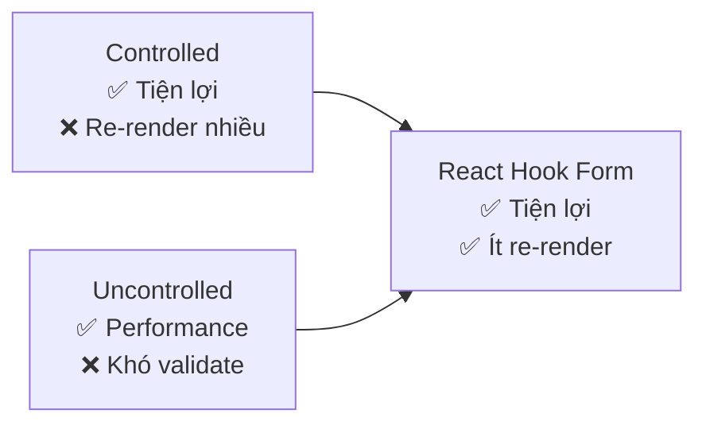
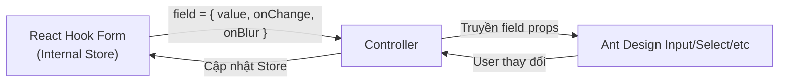

# Quản lý Form trong React — Controlled, Uncontrolled & React Hook Form

> [!IMPORTANT]
> Form là phần **không thể thiếu** trong mọi ứng dụng web. Câu hỏi phỏng vấn thường xoay quanh: "Controlled vs Uncontrolled khác gì?", "Tại sao dùng React Hook Form?", và "Kết hợp Ant Design Form với RHF như thế nào?". Hiểu rõ giúp bạn chọn đúng giải pháp cho mỗi dự án.

---

## 1. Controlled Component — React kiểm soát mọi thứ

### 1.1. Định nghĩa

Controlled Component là input mà **giá trị (value)** được lưu trong **React state**, và mỗi lần user gõ ký tự thì gọi `setState` → React re-render → cập nhật input.

```
User gõ "a" → onChange → setState("a") → React re-render → input hiện "a"
```

**React là "nguồn sự thật duy nhất" (Single Source of Truth).**

### 1.2. Code ví dụ

```jsx
function LoginForm() {
  const [email, setEmail] = useState("");
  const [password, setPassword] = useState("");
  const [errors, setErrors] = useState({});

  const validate = () => {
    const newErrors = {};
    if (!email.includes("@")) newErrors.email = "Email không hợp lệ";
    if (password.length < 6) newErrors.password = "Mật khẩu tối thiểu 6 ký tự";
    setErrors(newErrors);
    return Object.keys(newErrors).length === 0;
  };

  const handleSubmit = (e) => {
    e.preventDefault();
    if (validate()) {
      console.log("Submit:", { email, password });
    }
  };

  return (
    <form onSubmit={handleSubmit}>
      <input
        value={email}                          // ← React kiểm soát value
        onChange={(e) => setEmail(e.target.value)} // ← Mỗi ký tự → re-render
      />
      {errors.email && <span>{errors.email}</span>}

      <input
        type="password"
        value={password}
        onChange={(e) => setPassword(e.target.value)}
      />
      {errors.password && <span>{errors.password}</span>}

      <button type="submit">Đăng nhập</button>
    </form>
  );
}
```

### 1.3. Ưu & Nhược

| ✅ Ưu điểm | ❌ Nhược điểm |
|---|---|
| Dễ validate **real-time** (gõ đến đâu check đến đó) | Mỗi ký tự gõ = 1 lần `setState` = 1 lần **re-render** toàn form |
| Dễ disable button, format input, mask phone... | Form 20 fields = 20 state + 20 onChange → **code dài, lặp** |
| Dễ test (state là JS thuần) | Performance kém khi form phức tạp |
| React kiểm soát hoàn toàn giá trị | Cần thêm logic validate thủ công |

---

## 2. Uncontrolled Component — DOM kiểm soát, React "hỏi" khi cần

### 2.1. Định nghĩa

Uncontrolled Component là input mà **giá trị được lưu trong DOM**, không qua React state. Khi cần lấy giá trị, dùng `useRef` để truy cập DOM node.

```
User gõ "a" → DOM tự cập nhật → React KHÔNG biết → Khi submit, dùng ref.current.value
```

### 2.2. Code ví dụ

```jsx
function LoginFormUncontrolled() {
  const emailRef = useRef(null);
  const passwordRef = useRef(null);

  const handleSubmit = (e) => {
    e.preventDefault();
    // Chỉ lấy giá trị khi submit — KHÔNG re-render khi gõ
    const email = emailRef.current.value;
    const password = passwordRef.current.value;
    console.log("Submit:", { email, password });
  };

  return (
    <form onSubmit={handleSubmit}>
      <input ref={emailRef} defaultValue="" />       {/* defaultValue, KHÔNG phải value */}
      <input ref={passwordRef} type="password" />
      <button type="submit">Đăng nhập</button>
    </form>
  );
}
```

### 2.3. Ưu & Nhược

| ✅ Ưu điểm | ❌ Nhược điểm |
|---|---|
| **Không re-render** khi gõ → performance tốt | Khó validate real-time (phải tự gắn `onBlur`, `onInput`) |
| Code ít, đơn giản | Khó disable button dựa trên giá trị input |
| Tích hợp dễ với thư viện non-React | Không dễ format/mask input |
| Phù hợp form đơn giản (ít field) | Khó test hơn (phụ thuộc DOM) |

### 2.4. Khi nào dùng?

```
Controlled  → Form phức tạp, cần validate real-time, disable/enable button
Uncontrolled → Form đơn giản (ít field), file upload, tích hợp thư viện DOM
```

> [!NOTE]
> `<input type="file" />` **luôn là Uncontrolled** vì giá trị file chỉ có thể set bởi user, không thể set bằng JS (`value` là read-only).

---

## 3. So sánh Controlled vs Uncontrolled

| Tiêu chí | Controlled | Uncontrolled |
|---|---|---|
| **Giá trị lưu ở đâu?** | React State (`useState`) | DOM (truy cập qua `useRef`) |
| **Re-render** | Mỗi lần gõ ký tự | Chỉ khi submit |
| **Validate real-time** | ✅ Dễ | ❌ Khó |
| **Performance** | ❌ Chậm với form lớn | ✅ Nhanh |
| **Code boilerplate** | Nhiều (useState + onChange mỗi field) | Ít |
| **Keyword** | `value` + `onChange` | `defaultValue` + `ref` |
| **Lấy giá trị** | Luôn có sẵn trong state | Phải `.current.value` |

---

## 4. React Hook Form (RHF) — "Best of Both Worlds"

### 4.1. Tại sao cần RHF?

React Hook Form kết hợp điểm mạnh của cả hai:
- **Performance của Uncontrolled** → Dùng `ref` internal, KHÔNG re-render mỗi ký tự
- **Tiện lợi của Controlled** → Vẫn validate real-time, theo dõi giá trị, quản lý error...



### 4.2. Kiến trúc bên trong RHF

```mermaid
graph TB
    subgraph "React Hook Form"
        REG["register('fieldName')<br/>→ Trả về: ref, onChange, onBlur, name"]
        STORE["Internal Store<br/>(KHÔNG dùng React state)<br/>Lưu value, error, touched..."]
        HS["handleSubmit(onSubmit)<br/>→ Validate → Gọi onSubmit"]
    end

    INPUT["<input {...register('email')} />"] -- "Gắn ref + event" --> REG
    REG -- "Cập nhật giá trị qua ref" --> STORE
    STORE -- "Chỉ re-render khi error thay đổi" --> ERROR["formState.errors"]
    HS -- "Lấy values từ Store" --> SUBMIT["onSubmit(data)"]
```



**Điểm mấu chốt:** RHF lưu giá trị trong **internal store** (không phải React state) → Khi user gõ, **KHÔNG** trigger React re-render. Chỉ re-render khi error state thay đổi.

### 4.3. Code ví dụ cơ bản

```jsx
import { useForm } from "react-hook-form";

function LoginFormRHF() {
  const {
    register,      // Đăng ký field
    handleSubmit,  // Bọc hàm submit
    formState: { errors, isSubmitting },  // Trạng thái form
  } = useForm({
    defaultValues: { email: "", password: "" },
  });

  const onSubmit = async (data) => {
    // data = { email: "user@mail.com", password: "123456" }
    await loginAPI(data);
  };

  return (
    <form onSubmit={handleSubmit(onSubmit)}>
      {/* register() trả về { ref, onChange, onBlur, name } → spread vào input */}
      <input
        {...register("email", {
          required: "Email là bắt buộc",
          pattern: {
            value: /^[A-Z0-9._%+-]+@[A-Z0-9.-]+\.[A-Z]{2,}$/i,
            message: "Email không hợp lệ",
          },
        })}
        placeholder="Email"
      />
      {errors.email && <span>{errors.email.message}</span>}

      <input
        type="password"
        {...register("password", {
          required: "Password là bắt buộc",
          minLength: { value: 6, message: "Tối thiểu 6 ký tự" },
        })}
        placeholder="Password"
      />
      {errors.password && <span>{errors.password.message}</span>}

      <button disabled={isSubmitting} type="submit">
        {isSubmitting ? "Đang xử lý..." : "Đăng nhập"}
      </button>
    </form>
  );
}
```

### 4.4. RHF với Yup / Zod — Validate Schema nâng cao

```jsx
import { useForm } from "react-hook-form";
import { zodResolver } from "@hookform/resolvers/zod";
import { z } from "zod";

// Định nghĩa schema validate bên NGOÀI component → tái sử dụng được
const loginSchema = z.object({
  email: z.string().email("Email không hợp lệ"),
  password: z.string().min(6, "Tối thiểu 6 ký tự"),
});

// TypeScript suy ra type tự động từ schema!
type LoginFormData = z.infer<typeof loginSchema>;

function LoginForm() {
  const { register, handleSubmit, formState: { errors } } = useForm<LoginFormData>({
    resolver: zodResolver(loginSchema),  // ← Tích hợp Zod
  });

  const onSubmit = (data: LoginFormData) => {
    // data đã được validate, TypeScript biết chính xác type
    console.log(data.email, data.password);
  };

  return (
    <form onSubmit={handleSubmit(onSubmit)}>
      <input {...register("email")} />
      {errors.email && <span>{errors.email.message}</span>}
      {/* ... */}
    </form>
  );
}
```

> [!TIP]
> **Zod vs Yup:** Cả hai đều là schema validation, nhưng **Zod** phổ biến hơn hiện nay vì:
> - TypeScript-first (Yup cần thêm type riêng)
> - API trực quan hơn
> - `z.infer` tự động suy ra type → KHÔNG cần viết type 2 lần

---

## 5. Kết hợp React Hook Form + Ant Design (AntD)

### 5.1. Vấn đề — Tại sao không dùng `register()` trực tiếp?

Ant Design `<Input />`, `<Select />`, `<DatePicker />`... là **Controlled Component** tùy chỉnh, **KHÔNG phải** `<input>` HTML gốc → Không có `ref` gốc để RHF gắn vào.

```jsx
// ❌ KHÔNG HOẠT ĐỘNG — AntD Input không phải native <input>
<Input {...register("email")} />
// register() cần ref gốc, AntD Input không expose ref đúng cách
```

### 5.2. Giải pháp — `Controller` Component

RHF cung cấp `<Controller>` để **bọc bất kỳ Controlled Component nào** (AntD, MUI, Chakra...).



### 5.3. Code ví dụ — RHF + AntD

```jsx
import { useForm, Controller } from "react-hook-form";
import { Input, Select, DatePicker, Button, Form as AntForm } from "antd";
import { zodResolver } from "@hookform/resolvers/zod";
import { z } from "zod";
import dayjs from "dayjs";

const profileSchema = z.object({
  fullName: z.string().min(2, "Tên phải ít nhất 2 ký tự"),
  email: z.string().email("Email không hợp lệ"),
  role: z.enum(["admin", "user", "editor"], {
    errorMap: () => ({ message: "Chọn role" }),
  }),
  birthDate: z.any().refine((val) => val != null, "Chọn ngày sinh"),
});

type ProfileFormData = z.infer<typeof profileSchema>;

function ProfileForm() {
  const {
    control,         // ← Dùng control thay vì register
    handleSubmit,
    formState: { errors },
  } = useForm<ProfileFormData>({
    resolver: zodResolver(profileSchema),
    defaultValues: {
      fullName: "",
      email: "",
      role: undefined,
      birthDate: null,
    },
  });

  const onSubmit = (data: ProfileFormData) => {
    console.log("Form data:", data);
  };

  return (
    <AntForm layout="vertical" onFinish={handleSubmit(onSubmit)}>

      {/* ===== Text Input ===== */}
      <AntForm.Item
        label="Họ và Tên"
        validateStatus={errors.fullName ? "error" : ""}
        help={errors.fullName?.message}
      >
        <Controller
          name="fullName"
          control={control}
          render={({ field }) => (
            // field = { value, onChange, onBlur, name, ref }
            <Input {...field} placeholder="Nhập họ tên" />
          )}
        />
      </AntForm.Item>

      {/* ===== Select ===== */}
      <AntForm.Item
        label="Vai trò"
        validateStatus={errors.role ? "error" : ""}
        help={errors.role?.message}
      >
        <Controller
          name="role"
          control={control}
          render={({ field }) => (
            <Select
              {...field}
              placeholder="Chọn vai trò"
              options={[
                { value: "admin", label: "Admin" },
                { value: "user", label: "User" },
                { value: "editor", label: "Editor" },
              ]}
            />
          )}
        />
      </AntForm.Item>

      {/* ===== DatePicker ===== */}
      <AntForm.Item
        label="Ngày sinh"
        validateStatus={errors.birthDate ? "error" : ""}
        help={errors.birthDate?.message}
      >
        <Controller
          name="birthDate"
          control={control}
          render={({ field }) => (
            <DatePicker
              {...field}
              value={field.value ? dayjs(field.value) : null}
              onChange={(date) => field.onChange(date)}
              style={{ width: "100%" }}
            />
          )}
        />
      </AntForm.Item>

      <Button type="primary" htmlType="submit">Lưu</Button>
    </AntForm>
  );
}
```

### 5.4. Tại sao KHÔNG dùng AntD Form nội bộ?

| | RHF + AntD | AntD Form thuần (`Form.useForm()`) |
|---|---|---|
| **Validate** | Zod/Yup schema → **tái sử dụng** validate ở cả FE lẫn BE | Rules inline → **chỉ dùng ở FE** |
| **Re-render** | Ít re-render (RHF internal store) | AntD Form cũng tối ưu render tốt |
| **TypeScript** | `z.infer` → Auto type cực mạnh | Cần định nghĩa type riêng |
| **Linh hoạt** | Đổi UI library → chỉ đổi component, giữ logic | Gắn chặt với AntD |
| **Ecosystem** | Tích hợp DevTools, schema validation | Ít extension bên ngoài |
| **Khi nào dùng?** | Dự án lớn, cần validate phức tạp, nhiều UI lib | Dự án thuần AntD, form đơn giản |

> [!WARNING]
> **Đừng mix 2 hệ thống validate!** Nếu dùng RHF, thì KHÔNG dùng thêm `rules` prop của AntD `Form.Item`. Chọn 1 trong 2 làm "nguồn sự thật" cho validate.

---

## 6. So sánh tổng quát 3 cách quản lý Form

| Tiêu chí | Controlled (useState) | Uncontrolled (useRef) | React Hook Form |
|---|---|---|---|
| **Re-render khi gõ** | ✅ Mỗi ký tự | ❌ Không | ❌ Không (chỉ khi error thay đổi) |
| **Validate real-time** | ✅ Dễ | ❌ Khó | ✅ Dễ (`mode: "onChange"`) |
| **Code boilerplate** | 😰 Rất nhiều | 😊 Ít | 😊 Ít |
| **Performance** | ❌ Kém với form lớn | ✅ Tốt | ✅ Rất tốt |
| **DevTools** | Không có | Không có | ✅ RHF DevTools |
| **Tích hợp UI lib** | Dễ | Khó | ✅ `Controller` |
| **Schema validate** | Thủ công | Thủ công | ✅ Zod/Yup resolver |
| **Khi nào dùng** | Form < 3 fields, cần control tuyệt đối | File upload, form cực đơn giản | Form >= 3 fields, dự án production |

> [!TIP]
> **Kết luận thực tế:** Trong dự án production, **React Hook Form + Zod** là lựa chọn phổ biến nhất hiện nay vì:
> 1. Performance tốt (ít re-render)
> 2. TypeScript-first (type safety)
> 3. Schema validate tái sử dụng được
> 4. Tích hợp tốt với mọi UI library qua `Controller`

---

## 7. Cách trả lời phỏng vấn

> [!TIP]
> **Câu hỏi: "Controlled vs Uncontrolled Component là gì?"**
>
> *"Controlled Component là input mà giá trị được lưu trong React state — mỗi lần user gõ, gọi `setState` → re-render. React là nguồn sự thật duy nhất.*
>
> *Uncontrolled Component thì giá trị nằm trong DOM, truy cập qua `useRef`. React không biết giá trị cho đến khi mình chủ động đọc `ref.current.value`.*
>
> *Trong thực tế, em dùng **React Hook Form** vì nó kết hợp ưu điểm cả hai: performance như Uncontrolled (không re-render mỗi ký tự) nhưng tiện lợi như Controlled (validate, error tracking). Khi tích hợp với Ant Design, em dùng `Controller` component để bọc các custom component."*

> [!TIP]
> **Câu hỏi: "Tại sao không dùng AntD Form thuần mà lại dùng RHF?"**
>
> *"AntD Form thuần hoàn toàn OK cho các form đơn giản và dự án thuần AntD. Nhưng em chọn RHF khi:*
> 1. *Cần **tái sử dụng schema validate** giữa FE và BE (Zod)*
> 2. *Cần **TypeScript inference** tự động từ schema*
> 3. *Dự án có thể đổi UI library → logic form vẫn giữ nguyên*
> 4. *Form phức tạp nhiều bước (multi-step form)"*
